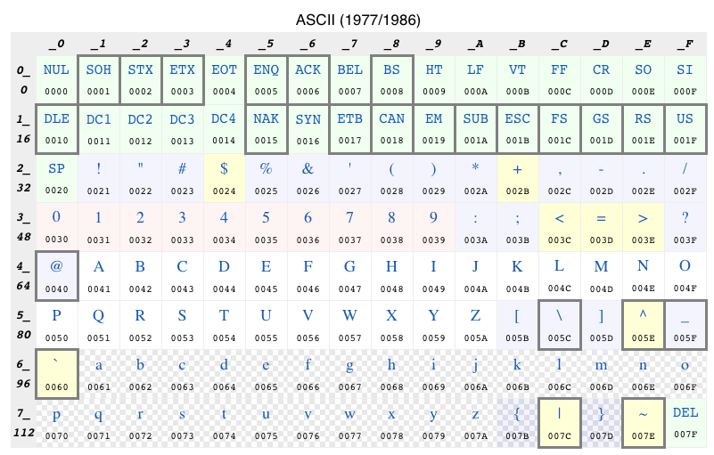

# Encode

## 编码-字符集

规定文字符合怎么编码，也就是各种语言的文字和符号怎么用二进制表示。所以这里我们说的编码，说的是文本文件，像图片视频这些不在范围内。符号对应的数字，称为码点。比如`1`的码点是`31`, 中文`好`的码点是`597d`， 两个字节。

### ascii
1. ASCII 码一共规定了128个字符的编码, 只占用了一个字节的后面7位，最前面的一位统一规定为0 
2. 表示英文的字符足够了，但是其他国家的文字符号没办法表示  



### Unicode
1. 新的编码方式，可以表示非常多的符号，现在的规模可以容纳100多万个符号，[官网](unicode.org)  

## 编码-编码方式

上面说的是字符集，只是规定了数字（二进制）和字符之间的一一对应关系，但是落实到计算机储存，就需要考虑实现的问题。这些数字用几个字节保存？对于ascii来说，这很简单，只需要一个字节，但是unicode字符集范围很广，很多字符的码点都是大于255，一个字节不能表示。

用多字节表示的话， 有个问题必须解决，计算机怎么知道三个字节表示一个符号，还是分别表示三个符号？

现在有三种编码方式：
|编码方式|bytes|
|--|:--|
|utf-8|1-4 个字节|
|utf-16|2 or 4 个字节|
|utf-32|统一4个字节|

### UTF-8


|(十六进制)        |              （二进制）|
|--|--|
|0000 0000-0000 007F | 0xxxxxx|
|0000 0080-0000 07FF | 110xxxxx 10xxxxxx|
|0000 0800-0000 FFFF | 1110xxxx 10xxxxxx 10xxxxxx|
|0001 0000-0010 FFFF | 11110xxx 10xxxxxx 10xxxxxx 10xxxxxx|

如果开头是1，则表明是多个字节表示一个符号，再看后面一个字节的开头，这样就可以解决上面的那个问题。

### UTF-16

  
UTF-16 用二个字节来表示基本平面，用四个字节来表示扩展平面

在这种编码方式下，一种情况是两个字节表示一个符号，如果不足的就用0补齐，比如ascii字符集里的那些符号。这样也可以区分，解决上面的那个问题。

那什么时候用四个字节来表示呢？在UTF-16编码里，``U+D800`到`U+DFFF`是一个空段，即这些码点不对应任何字符。扩展平面的字符位共有2^20个，UTF-16将这20位拆成两半，前10位映射在U+D800到U+DBFF（空间大小210），称为高位（H），后10位映射在U+DC00到U+DFFF（空间大小210），称为低位（L）用来映射扩展平面的字符。比如'𝌆'就是扩展平面的字符，码点是`U+1D306` ,通过计算公式：

```javascript
H = Math.floor((c-0x10000) / 0x400)+0xD800

L = (c - 0x10000) % 0x400 + 0xDC00
```

可以得到高位和低位 :

```javascript
H = Math.floor((0x1D306-0x10000)/0x400)+0xD800 = 0xD834

L = (0x1D306-0x10000) % 0x400+0xDC00 = 0xDF06
```

其编码就是0xD834 DF06，长度为四个字节。

可以用js验证如下：

```js
'𝌆'.charCodeAt(0).toString(16) -> 'd834'
'𝌆'.charCodeAt(1).toString(16) -> 'df06'
```

所以当用charCodeAt取到码点在`d800` ~`dfff` 之间，比如这里的`d834`，我们就知道应该连后面的字节一起来表示的是一个字节.

[An online tool](https://www.qqxiuzi.cn/bianma/Unicode-UTF.php)  
[Unicode wikipedia](https://unicode-table.com/cn/)  

### UTF-32

所有的都用4个字节表示，不足的用0补齐，这样的缺点就是浪费空间。

## 使用

网页编码用的是utf-8，文本编辑器用的也是utf-8，JavaScript对字符串的编码最初用的是`UCS-2` ，是 `UTF-16` 的子集，后来从ES6用的就是 `UTF-16`.

### js 字符编码相关的api

获得对应字符的码点：  
```js
'🏃'.charCodeAt() // if it exceeds 65536, only display the first two bytes
55356

'🏃'.codePointAt() // use codePoint get all
127939

new TextEncoder().encode('È')  // utf-8
-> Uint8Array(2) [195, 136]
```
`€` is the `128`th character. so in utf-8, it needs two bytes. It's the first character deserve two bytes, congrats europe dollar!

js 里可以直接用utf-16来表示字符（注意：在其它语言里有char这个类型，js里只有string），像这样：

```js
s='\uD834\uDF06' -> '𝌆'
```

也可以用码点来得到字符：

```js
String.fromCharCode(0x597d)->'好'
```

但是，扩展平面的字符不能这么搞，比如：

```js
String.fromCharCode(0x1d306) -> '팆' //这个是不对的，我们知道1d306对应的应该是'𝌆'
String.fromCodePoint(0x1d306) -> '𝌆' // 用这个方法得到的结果就是对的
String.fromCharCode(55551) -> '\uD8FF' // 这个刚好就是不对应任何字符的那个区间，之间返回unicode码点，55551的16进制就是d8ff
```

### 一个乱码问题

```js
 fetch('https://img.webmd.com/dtmcms/live/webmd/consumer_assets/site_images/article_thumbnails/other/scoop_on_cat_poop_other/1800x1200_scoop_on_cat_poop_other.jpg?resize=600px:*').then(res => res.text()).then(d => console.log(d))
-> ����\ // 后面一大堆省略
```

这里尝试把图片的二进制当文本来看待，用字符编码转换，就找不到对应符号，出现这种六边形里有个？的符号。图片的二进制是保存的图片的信息，颜色线条等等，所以制作一个图片查看软件也就是用这些二进制来调动计算机的绘图来展示图片。

为了取得二进制，应该用`res.blob()`方法：

```js
fetch('https://img.webmd.com/dtmcms/live/webmd/consumer_assets/site_images/article_thumbnails/other/scoop_on_cat_poop_other/1800x1200_scoop_on_cat_poop_other.jpg?resize=600px:*').then(res => res.blob()).then(d => console.log(d))

-> Blob {size: 22098, type: 'image/jpeg'}
         // 或者用arrayBuffer
         fetch('https://img.webmd.com/dtmcms/live/webmd/consumer_assets/site_images/article_thumbnails/other/scoop_on_cat_poop_other/1800x1200_scoop_on_cat_poop_other.jpg?resize=600px:*').then(res => res.arrayBuffer()).then(d => console.log(d))

-> ArrayBuffer(22098)
```


refs:

1. 绕不过的阮老师[字符编码笔记：ASCII，Unicode 和 UTF-8](http://www.ruanyifeng.com/blog/2007/10/ascii_unicode_and_utf-8.html)  
2. [Unicode与JavaScript详解](https://www.ruanyifeng.com/blog/2014/12/unicode.html)