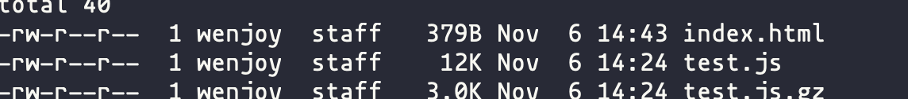
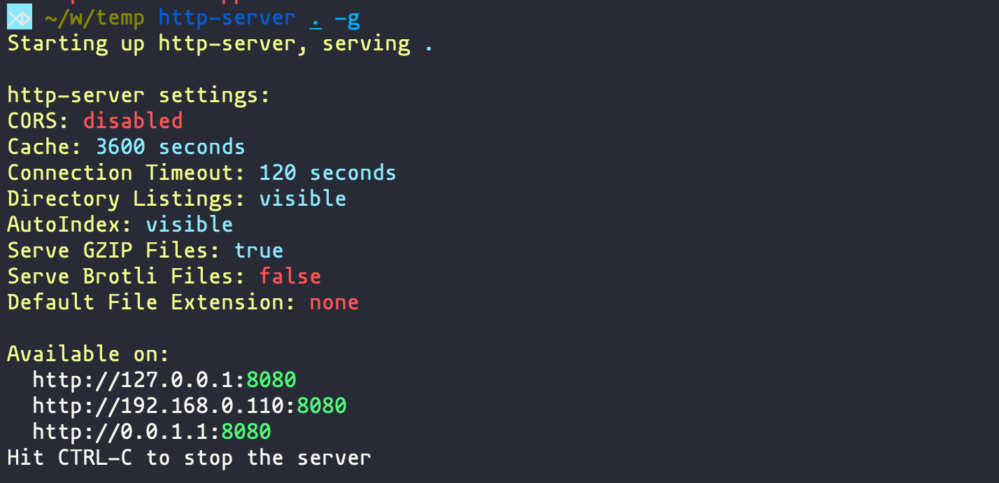
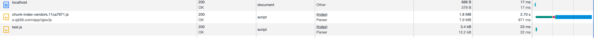
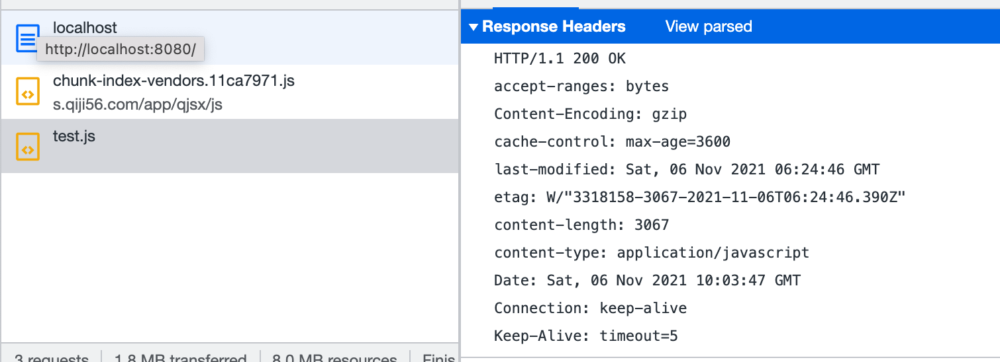

gzip

gzip 是一种压缩的格式，主要是针对文本的。在http中广泛被利用来优化静态资源比如html，css，js 这些文本资源的传输速度。相关规范是[RFC 1952](https://link.juejin.cn/?target=https%3A%2F%2Ftools.ietf.org%2Fhtml%2Frfc1952)。

算法是基于deflate的，deflate是放气的意思，与之相反的是inflate。对应的压缩和解压过程。deflate算法是由LZ77和Huffman coding结合来做压缩解压的。具体的代码实现，常用的库叫做Zlib。

linux下有命令行工具`gzip`可以用，比如



对`test.js` 压缩生成了`test.js.gz` 的压缩包，是个二进制。

## 网站中开启

一种是动态的，服务器收到请求后对对应资源进行压缩，比如nginx配置：

```nginx
# 开启gzip
gzip on;
# 启用gzip压缩的最小文件，小于设置值的文件将不会压缩
gzip_min_length 1k;
# gzip 压缩级别，1-10，数字越大压缩的越好，也越占用CPU时间，后面会有详细说明
gzip_comp_level 2;
# 进行压缩的文件类型。javascript有多种形式。其中的值可以在 mime.types 文件中找到。
gzip_types text/plain application/javascript application/x-javascript text/css application/xml text/javascript;

```


或者node下面有

```js
const CompressionWebpackPlugin = require('compression-webpack-plugin');

webpackConfig.plugins.push(
    new CompressionWebpackPlugin({
      asset: '[path].gz[query]',
      algorithm: 'gzip',
      test: new RegExp('\\.(js|css)$'),
      threshold: 10240,
      minRatio: 0.8
    })
)
```

一种是预先打包好压缩资源，比如我上面的test.js. 然后响应请求的时候去找到对应的gz包就可以了。

比如上面的我的测试，我用http-server托管，并打开gzip后：



## 怎么判断服务器有没有成功开启gzip

可以在network里直接看



如果size一栏有两个size并且差距很大就大致判断生效了

更直接的是看http header



response header里有`Content-Encoding: gzip` 就表示成功了。 但是header里看不到压缩前有多大。

参考：

https://segmentfault.com/a/1190000012800222

https://juejin.cn/post/6844903661575880717