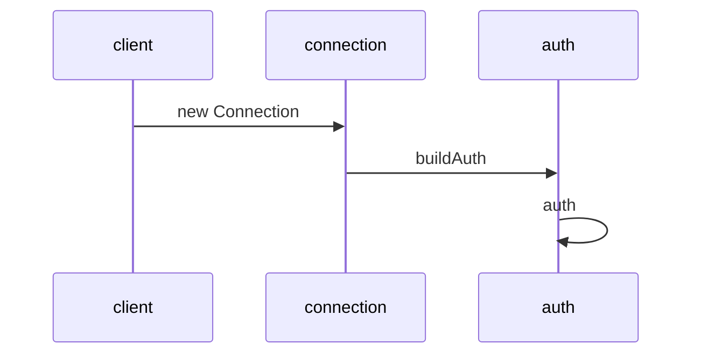
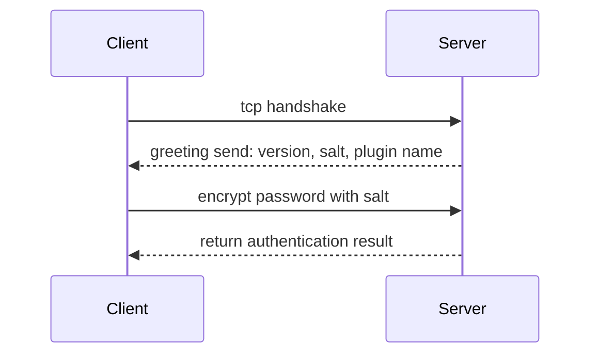

[ref mysqljs](https://github.com/mysqljs/mysql/pull/2233/files?file-filters%5B%5D=.js&file-filters%5B%5D=.key&file-filters%5B%5D=.yml&w=1)
[official mysql module](https://dev.mysql.com/doc/dev/connector-nodejs/8.0/)
[official mysql doc -- protocol part](https://dev.mysql.com/doc/dev/mysql-server/8.0.12/page_protocol_basics.html)
[official deno doc](https://doc.deno.land/https/github.com/denoland/deno/releases/latest/download/lib.deno.d.ts#Deno.connect)

`new Client` create an instance
`connect()` -> `createConnection()` -> `new Connection()`
create `Connection` instance
invoke `connect()` -> `_connect()` -> `Deno.connect()` -> `nextPacket()` -> `parseHandshakePacket()` -> `buildAuth()`
`buildAuth()`
if password true, call `auth()`
handle password base on `authPluginName`

## mysql protocol
### for 5.7 and below

plugin name: `mysql_native_passowrd`

plugin name: `caching_sha2_password`