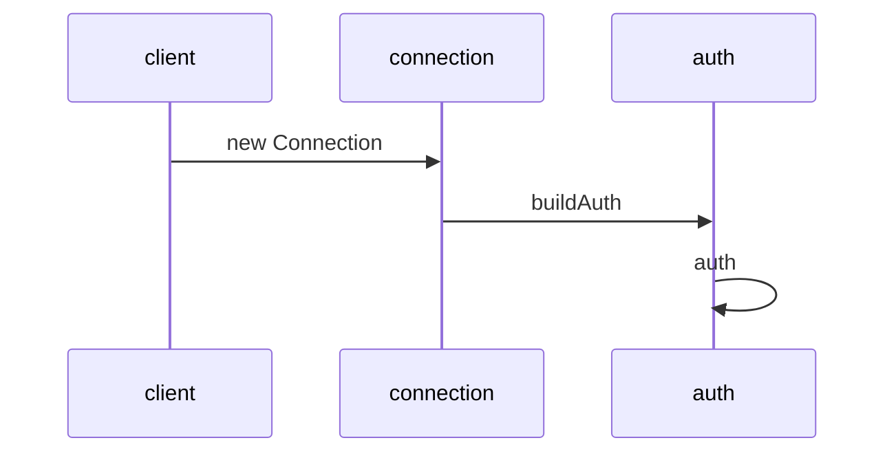
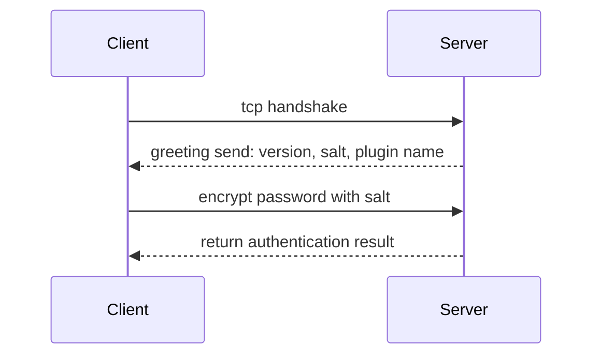

`new Client` create an instance
`connect()` -> `createConnection()` -> `new Connection()`
create `Connection` instance
invoke `connect()` -> `_connect()` -> `Deno.connect()` -> `nextPacket()` -> `parseHandshakePacket()` -> `buildAuth()`
`buildAuth()`
if password true, call `auth()`
handle password base on `authPluginName`

## mysql protocol
### for 5.7 and below

plugin name: `mysql_native_passowrd`

plugin name: `caching_sha2_password`