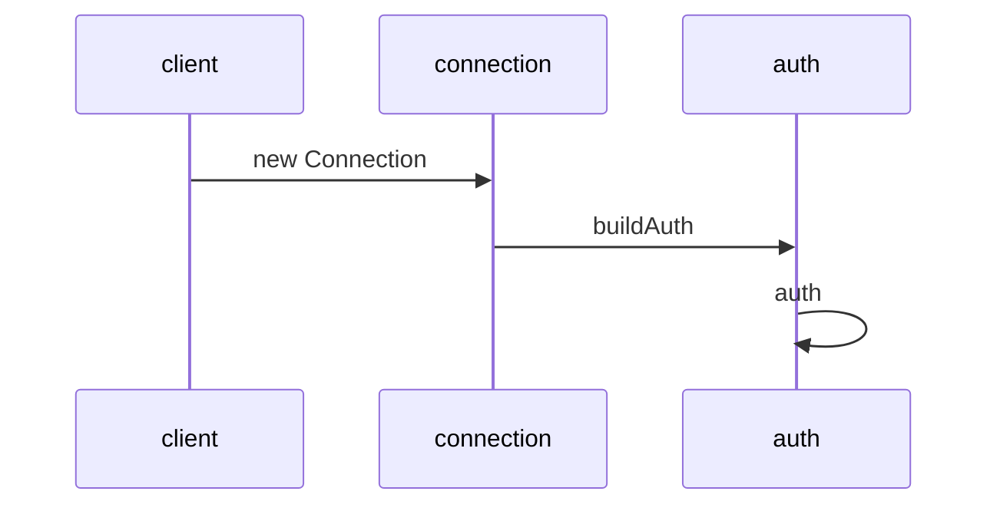
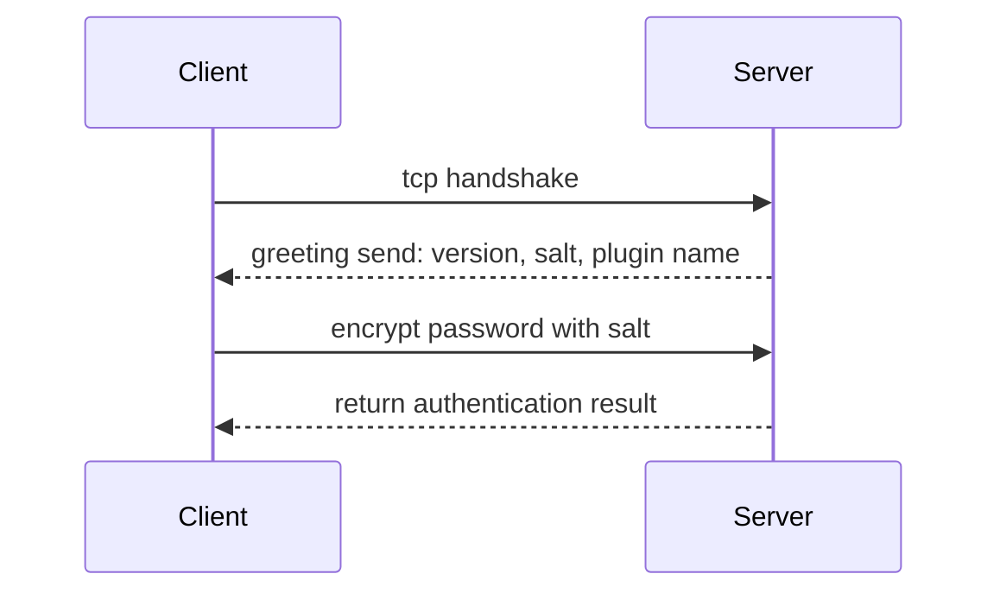
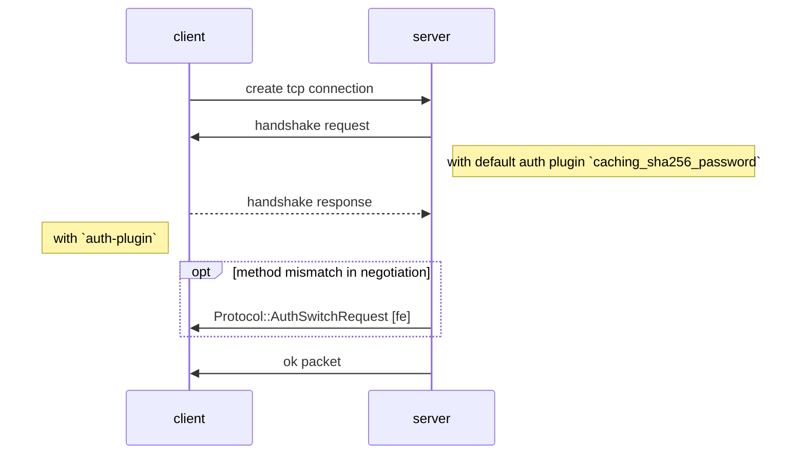
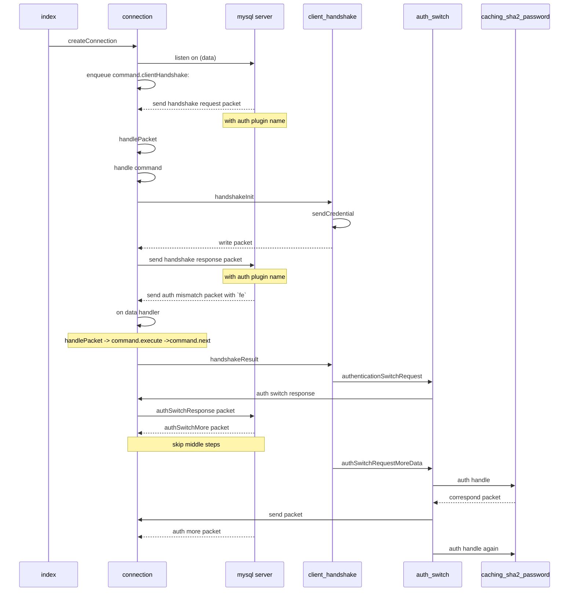

# Notes of deno-mysql

## roadmap
I try deno with mysql
get error, found it is mysql 8 auth problem.
I determine to help to realize this function

I read mysql documents
I clone deno-mysql lib to hack
I try use wireshark capture packet
I review tcp handshake
I learn binary related stuff, like big endian, bit operator
learn u int8 array
i thought i solve the problem with hard code way, talk to repo owner found i just missed fast auth and full auth, there should be public key transport process
I read the docs again, and ref the mysql-node2 lib, grasp the full auth way which will send public key
then i found deno doesn't have `crypto` module like node.
I read book about cipher
the repo owner send me a `jsencrypt` lib, but I found it only support pkcs 1 padding, i doubt mysql only support pkcs oaep way

I try to use `rust`'s `rsa` lib in deno. But it's not so easy. I Do find `Deno.openPlugin` api, but it require `.so`. I have no idea about `.so` at all.

    (1) .dll .obj .lib使用在windows平台下。
        .dll：动态链接库，作为共享函数库的可执行文件。
        .obj：目标文件，相当于源代码对应的二进制文件，未经重定位。
        .lib：可理解为多个obj的集合，本质与.obj相同。


    (2) .so .o .a使用在linux平台下。
            .so：(share object)动态链接库，跟Windows平台类似。
            .o： 目标文件，相当于源代码对应的二进制文件。
            .a： 与.o类似，多个.o的集合。

## steps to pass authentication of caching_sha2_password of mysql8.0
1. reading official document about handshake
2. ref similar libs on github
3. learn about `mysql protocol` `capture packet with wireshark` `ts syntax` `rsa crypt` `arrayBuffer api of js`

[Web Crypto API](https://developer.mozilla.org/en-US/docs/Web/API/SubtleCrypto/encrypt)
[GPG入门教程](https://www.ruanyifeng.com/blog/2013/07/gpg.html)

## mysql documents

[ref mysqljs](https://github.com/mysqljs/mysql/pull/2233/files?file-filters%5B%5D=.js&file-filters%5B%5D=.key&file-filters%5B%5D=.yml&w=1)  
[official mysql module](https://dev.mysql.com/doc/dev/connector-nodejs/8.0/)  
[mysql blog](https://mysqlserverteam.com/mysql-8-0-4-new-default-authentication-plugin-caching_sha2_password/)
[official mysql doc -- protocol part](https://dev.mysql.com/doc/dev/mysql-server/8.0.12/page_protocol_basics.html)   
[another version??? official mysql doc -- protocol part](https://dev.mysql.com/doc/internals/en/mysql-packet.html)  
[official deno doc](https://doc.deno.land/https/github.com/denoland/deno/releases/latest/download/lib.deno.d.ts#Deno.connect)

原来官方文档里面有 example 啊， 早翻到的话，节省不少时间哇  
[Protocol Examples](https://dev.mysql.com/doc/internals/en/client-wants-native-server-wants-old.html)

[explanation of this 0103 packet- auth more data ](https://dev.mysql.com/doc/internals/en/successful-authentication.html)

[a blog about protocol stuff](https://promacanthus.netlify.app/experience/mysql/08-%E5%8D%8F%E8%AE%AE%E8%A7%A3%E6%9E%90-%E8%BF%9E%E6%8E%A5%E9%98%B6%E6%AE%B5/)

[another lib node-mysql2](https://github.com/sidorares/node-mysql2/tree/feature/fast-caching_sha2_password)


[sample of Understanding MySQL INternals by Sasha Pachev](https://www.oreilly.com/library/view/understanding-mysql-internals/0596009577/ch04.html)

[interpreter of caching_sha2_password, if i saw this earlier would better](https://dev.mysql.com/doc/dev/mysql-server/8.0.12/page_caching_sha2_authentication_exchanges.html#sect_caching_sha2_info)

[another doc](https://mariadb.com/kb/en/caching_sha2_password-authentication-plugin/)


very nice article, concise  
[Writing MySQL Proxy in GO for self-learning](https://medium.com/@alexanderravikovich/writing-mysql-proxy-in-go-for-learning-purposes-part-2-decoding-connection-phase-server-response-7091d87e877e)  

## source code of deno-mysql

`new Client` create an instance
`connect()` -> `createConnection()` -> `new Connection()`
create `Connection` instance
invoke `connect()` -> `_connect()` -> `Deno.connect()` -> `nextPacket()` -> `parseHandshakePacket()` -> `buildAuth()`
`buildAuth()`
if password true, call `auth()`
handle password base on `authPluginName`



## mysql protocol
### for 5.7 and below

plugin name: `mysql_native_passowrd`



plugin name: `caching_sha2_password`


## supplement knowledge
### TypedArray
ArrayBuffer是一块内存，比如var buf = new ArrayBuffer(1024)，就等于开辟了一块1kb大小的内存，但是你不能通过buf变量的索引去操作这块内存，比如console.log(buf[0])得到的是undefined，如果buf[0]=77,进行赋值操作，只是在buf对象上添加了一个属性名为‘0’的属性，并没有改变内存块中第一个字节的数据，如果想操作内存块中的数据，可以通过var int8= new Int8Array(buf)然后通过int8[0]=12;来操作这块内存中的数据，也可以用Int16Array(buf)，Int32Array(buf)等，传入的是同一块内存块的引用则操作同一块内存块，剩下的自己理解吧。


为什么存在：javaScript与显卡通信的时候，大量的实时的数据交互，用文本格式需要进行格式转化，二进制则省去转化时间。

二进制数组由三类对象组成：

ArrayBuffer对象：代表内存之中的一段二进制数据，本身不能直接操作内存，需要通过“视图”进行操作。“视图”部署了数组接口，这意味着，可以用数组的方法操作内存。
TypedArray视图：共包括 9 种类型的视图，比如Uint8Array（无符号 8 位整数）数组视图, Int16Array（16 位整数）数组视图, Float32Array（32 位浮点数）数组视图等等。
DataView视图：可以自定义复合格式的视图，比如第一个字节是 Uint8（无符号 8 位整数）、第二、三个字节是 Int16（16 位整数）、第四个字节开始是 Float32（32 位浮点数）等等，此外还可以自定义字节序。


和数组的区别 TypedArray内的成员只能是同一类型 TypedArray成员是连续的，不会有空位 TypedArray成员的默认值为0，数组的默认值为空 TypedArray只是视图，本身不存储数据，数据都存储在底层的ArrayBuffer中，要获取底层对象必须使用buffer属性 TypedArray可以直接操作内存，不需要进行类型转换，所以比数组快 TypedArray数组有的方法都可以使用，但不能使用cancat方法

DataView视图提供更多操作选项，而且支持设定字节序。本来，在设计目的上，ArrayBuffer对象的各种TypedArray视图，是用来向网卡、声卡之类的本机设备传送数据，所以使用本机的字节序就可以了；而DataView视图的设计目的，是用来处理网络设备传来的数据，所以大端字节序或小端字节序是可以自行设定的。 大端字节序和小端字节序，x86体系的计算机都使用小端字节序，123456中12比较重要，所以排在后面，存储顺序是563412。大端则相反  

视图的构造函数接受三个参数，第一个ArrayBuffer对象，第二个视图开始的字节号（默认0），第三个视图结束的字节号（默认直到本段内存区域结束）

const buffer = new ArrayBuffer(12);
const a = new Uint8Array(buffer, 0, 1); // 以Uint8Array读取第一个字节
a[0] = 1;
const b = new Int32Array(buffer, 1, 2); // 以Int32Array读取第二个字节
b[0] = 2;

[二进制数组](https://javascript.ruanyifeng.com/stdlib/arraybuffer.html)
```binary
02000002 01030700 00030000 00020000 00
```
### big endian and little endian

mysql ` Protocol::HandshakeResponse: packet` is little endian? big endian can't match

[二进制的经典应用-标志位与掩码](https://www.jianshu.com/p/5c352d83e57c)
[“字节序”网络中的大小端问题](https://juejin.im/post/5eaf96666fb9a0432d76c6a9)
[理解字节序](https://www.ruanyifeng.com/blog/2016/11/byte-order.html)
[How to teach endian](https://blog.erratasec.com/2016/11/how-to-teach-endian.html)

网络字节顺序是TCP/IP中规定好的一种数据表示格式，它与具体的CPU类型、操作系统等无关，从而可以保证数据在不同主机之间传输时能够被正确解释。网络字节顺序采用big endian排序方式。
[网络序？本地序？傻傻分不清楚。。。](https://imweb.io/topic/57fe263b2a25000c315a3d8a)

[Oreilly official](https://www.oreilly.com/)

### bit operator 

### encrypt with rsa
need to use RSA encrypt
#### learn about RSA more
[RSA算法原理1](https://www.ruanyifeng.com/blog/2013/06/rsa_algorithm_part_one.html)
[RSA算法原理2](http://www.ruanyifeng.com/blog/2013/07/rsa_algorithm_part_two.html)
[node crypto](https://www.liaoxuefeng.com/wiki/1022910821149312/1023025778520640)

### parse a packet manual

#### initial handshake  

protocol version: 0a
server version: 38 2e 30 2e 32 30
connection id:3d 00 00 00
auth_plugin_data_part_1:40 46 33 06 25 6d 47 09
filler_1: 00
capability_flag_1 lower 2 bytes :ff ff
character_set: ff(utf8mb4)
status_flags :02 00
capability_flags_2 upper 2 bytes: ff c7
auth_plugin_data_len:15
string[10]     reserved (all [00]): 00 00 00 00 00 00 00
00 00 00
auth-plugin-data-part-2:4b 0c 5b 53 1f 15 04 7e 02 29 26 27 00
auth_plugin_name:63 61 63 68 69 6e 67 5f 73 68 61 32 5f 70 61 73
73 77 6f 72 64 00

#### handshake response

capability_flags:  85 a6 ff 01
max_packet_size: 00 00 00 01
character_set: 21
string[23]     reserved (all [0]): 00 00 00 00 00 00 00 00 00 00 00 00 00 00 00 00 00 00 00 00 00 00 00
username: 72 6f 6f 74
auth-response: 00 
database:
auth plugin name: 6d 79 73 71 6c 5f 6e 61 74 69 76 65 5f 70 61 73 73 77 6f 72 64
CLIENT_CONNECT_ATTRS: 69 03 5f 6f 73 08 6f 73
78 31 30 2e 31 34 0c 5f 63 6c 69 65 6e 74 5f 6e
61 6d 65 08 6c 69 62 6d 79 73 71 6c 04 5f 70 69
64 05 31 39 38 33 37 0f 5f 63 6c 69 65 6e 74 5f
76 65 72 73 69 6f 6e 06 35 2e 37 2e 32 39 09 5f
70 6c 61 74 66 6f 72 6d 06 78 38 36 5f 36 34 0c
70 72 6f 67 72 61 6d 5f 6e 61 6d 65 05 6d 79 73
71 6c

0000   02 00 00 00 45 00 00 fe 00 00 40 00 40 06 00 00   ....E.....@.@...
0010   7f 00 00 01 7f 00 00 01 e3 68 0c eb e3 31 f9 62   .........h...1.b
0020   6e 04 04 7c 80 18 18 ea fe f2 00 00 01 01 08 0a   n..|............
0030   2f ed 5c 95 2f ed 5c 95 ^c6 00 00 01 85 a6 ff 01   /.\./.\.........
0040   00 00 00 01 21 00 00 00 00 00 00 00 00 00 00 00   ....!...........
0050   00 00 00 00 00 00 00 00 00 00 00 00 72 6f 6f 74   ............root
0060   00 20 90 d9 1d a9 2e 6b f9 78 48 1e 97 e2 6a e7   . .....k.xH...j.
0070   ed cc 99 82 a7 1e 05 72 c0 a9 43 bc c1 f6 8f fe   .......r..C.....
0080   c3 e0 63 61 63 68 69 6e 67 5f 73 68 61 32 5f 70   ..caching_sha2_p
0090   61 73 73 77 6f 72 64 00 69 03 5f 6f 73 08 6f 73   assword.i._os.os
00a0   78 31 30 2e 31 34 0c 5f 63 6c 69 65 6e 74 5f 6e   x10.14._client_n
00b0   61 6d 65 08 6c 69 62 6d 79 73 71 6c 04 5f 70 69   ame.libmysql._pi
00c0   64 05 33 37 35 32 34 0f 5f 63 6c 69 65 6e 74 5f   d.37524._client_
00d0   76 65 72 73 69 6f 6e 06 35 2e 37 2e 32 39 09 5f   version.5.7.29._
00e0   70 6c 61 74 66 6f 72 6d 06 78 38 36 5f 36 34 0c   platform.x86_64.
00f0   70 72 6f 67 72 61 6d 5f 6e 61 6d 65 05 6d 79 73   program_name.mys
0100   71 6c                                             ql

capability flag
|flag|binary|
|--|--|
|CLIENT_LONG_PASSWORD|00000000 00000000 00000000 00000001|
|CLIENT_FOUND_ROWS|00000000 00000000 00000000 00000010|
|CLIENT_LONG_FLAG|00000000 00000000 00000000 00000100|
|CLIENT_CONNECT_WITH_DB|00000000 00000000 00000000 00001000|
|CLIENT_NO_SCHEMA|00000000 00000000 00000000 00010000|
|CLIENT_COMPRESS|00000000 00000000 00000000 00100000|
|CLIENT_ODBC|00000000 00000000 00000000 01000000|
|CLIENT_LOCAL_FILES|00000000 00000000 00000000 10000000|
|CLIENT_IGNORE_SPACE|00000000 00000000 00000001 00000000|
|CLIENT_PROTOCOL_41|00000000 00000000 00000010 00000000|
|CLIENT_INTERACTIVE|00000000 00000000 00000100 00000000|
|CLIENT_SSL|00000000 00000000 00001000 00000000|
|CLIENT_IGNORE_SIGPIPE|00000000 00000000 00010000 00000000|
|CLIENT_TRANSACTIONS|00000000 00000000 00100000 00000000|
|CLIENT_RESERVED|00000000 00000000 01000000 00000000|
|CLIENT_SECURE_CONNECTION|00000000 00000000 10000000 00000000|
|CLIENT_MULTI_STATEMENTS|00000000 00000001 00000000 00000000|
|CLIENT_MULTI_RESULTS|00000000 00000010 00000000 00000000|
|CLIENT_PS_MULTI_RESULTS|00000000 00000100 00000000 00000000|
|CLIENT_PLUGIN_AUTH|00000000 00001000 00000000 00000000|
|CLIENT_CONNECT_ATTRS|00000000 00010000 00000000 00000000|
|CLIENT_PLUGIN_AUTH_LENENC_CLIENT_DATA|00000000 00100000 00000000 00000000|
|CLIENT_CAN_HANDLE_EXPIRED_PASSWORDS|00000000 01000000 00000000 00000000|
|CLIENT_SESSION_TRACK|00000000 10000000 00000000 00000000|
|CLIENT_DEPRECATE_EOF|00000001 00000000 00000000 00000000|


---

I refed a lib called 'node-mysql2', and this is its call sequences graph:



