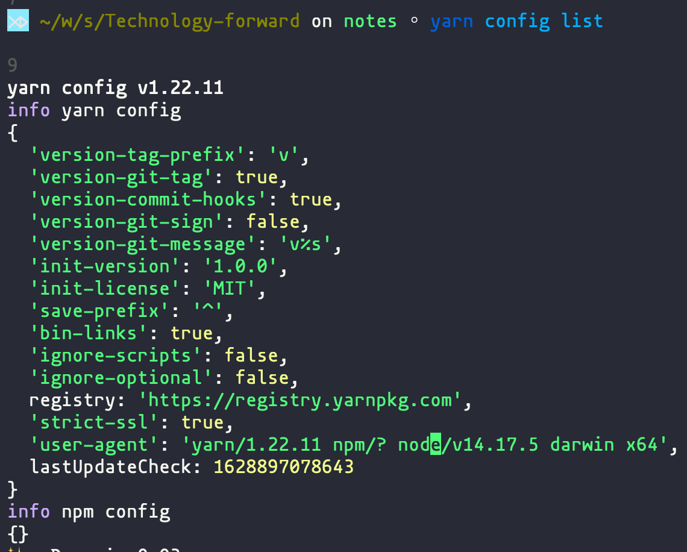
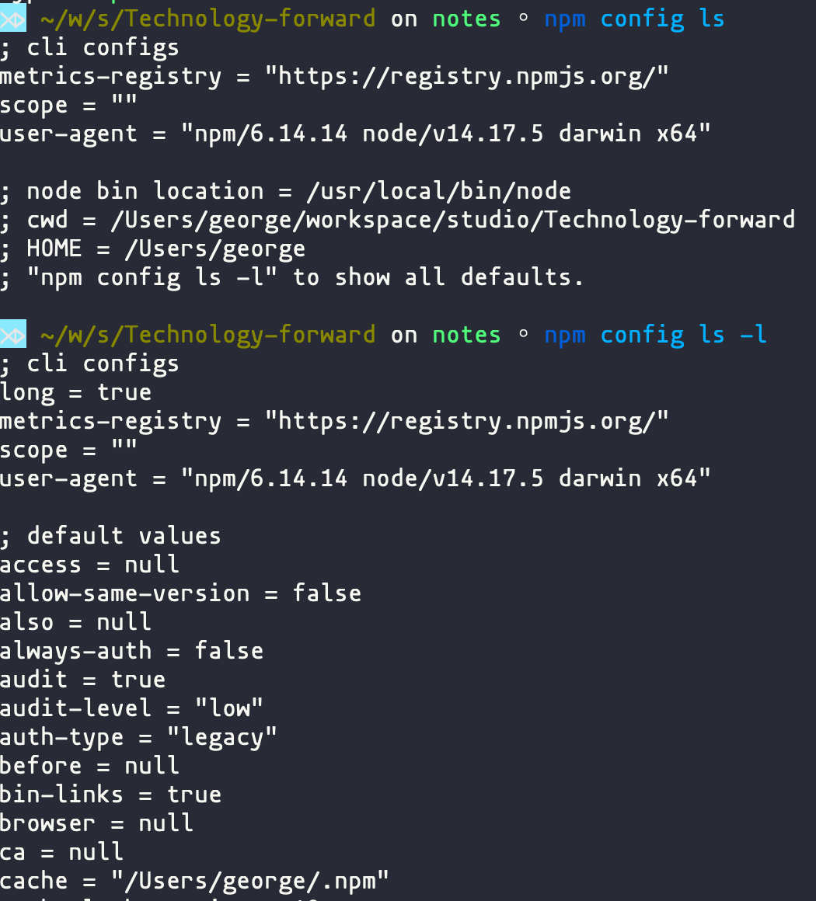

## compare luxon with dayjs
both for replacement of momentjs
[luxon](https://moment.github.io/luxon/#/tour) vs [dayjs](https://github.com/iamkun/dayjs/blob/dev/docs/zh-cn/README.zh-CN.md)

## yarn and config

### output compare

|`yarn config list`|`npm config ls`|
|--|--|
|||

`https://registry.yarnpkg.com` is just proxy to npm official registry, ref [Why registry.yarnpkg.com? ](https://yarnpkg.com/getting-started/qa#why-registryyarnpkgcom-does-facebook-track-us)

### change registry

`yarn config set registry 'https://registry.npm.taobao.org'`  
`npm config set registry 'https://registry.npm.taobao.org'`

why yarn config list will display npm config info??

### reset registry
`yarn config delete registry`  

### .yarnrc
set per project yarn registry by add this line in `.yarnrc`  
`registry "https://registry.npm.my.org"`

NOTE: if set	`~/.npmrc` it will adapt this firstly, project configured `.yarnrc` will not work.

```bash
⋊> ~/w/s/react_project_boilerplate yarn add --verbose dayjs                                                               21:15:06
yarn add v1.22.11
verbose 0.145078799 Checking for configuration file "/Users/george/workspace/studio/react_project_boilerplate/.npmrc".
verbose 0.145306335 Checking for configuration file "/Users/george/.npmrc".
verbose 0.145502783 Found configuration file "/Users/george/.npmrc".
verbose 0.146427009 Checking for configuration file "/usr/local/etc/npmrc".
verbose 0.146601483 Checking for configuration file "/Users/george/workspace/studio/react_project_boilerplate/.npmrc".
verbose 0.146747489 Checking for configuration file "/Users/george/workspace/studio/.npmrc".
verbose 0.146879381 Checking for configuration file "/Users/george/workspace/.npmrc".
verbose 0.146988348 Checking for configuration file "/Users/george/.npmrc".
verbose 0.147109363 Found configuration file "/Users/george/.npmrc".
verbose 0.147348164 Checking for configuration file "/Users/.npmrc".
verbose 0.148694714 Checking for configuration file "/Users/george/workspace/studio/react_project_boilerplate/.yarnrc".
verbose 0.148820604 Found configuration file "/Users/george/workspace/studio/react_project_boilerplate/.yarnrc".
verbose 0.14906802 Checking for configuration file "/Users/george/.yarnrc".
verbose 0.149216907 Found configuration file "/Users/george/.yarnrc".
verbose 0.149427201 Checking for configuration file "/usr/local/etc/yarnrc".
verbose 0.149549484 Checking for configuration file "/Users/george/workspace/studio/react_project_boilerplate/.yarnrc".
verbose 0.149649532 Found configuration file "/Users/george/workspace/studio/react_project_boilerplate/.yarnrc".
verbose 0.149843512 Checking for configuration file "/Users/george/workspace/studio/.yarnrc".
verbose 0.149950751 Checking for configuration file "/Users/george/workspace/.yarnrc".
verbose 0.150045497 Checking for configuration file "/Users/george/.yarnrc".
verbose 0.150127905 Found configuration file "/Users/george/.yarnrc".
verbose 0.15032188 Checking for configuration file "/Users/.yarnrc".
verbose 0.15214276 current time: 2021-08-15T13:15:08.611Z
verbose 0.165909083 Performing "GET" request to "https://yarnpkg.com/latest-version".
info There appears to be trouble with your network connection. Retrying...
[1/4] 🔍  Resolving packages...
verbose 0.201068496 Performing "GET" request to "https://registry.npm.taobao.org/dayjs".
verbose 3.199980039 Performing "GET" request to "https://yarnpkg.com/latest-version".
verbose 3.200505166 Performing "GET" request to "https://registry.npm.taobao.org/dayjs".
info There appears to be trouble with your network connection. Retrying...
```

``` bash
yarn config v1.22.11
info yarn config
{
  'version-tag-prefix': 'v',
  'version-git-tag': true,
  'version-commit-hooks': true,
  'version-git-sign': false,
  'version-git-message': 'v%s',
  'init-version': '1.0.0',
  'init-license': 'MIT',
  'save-prefix': '^',
  'bin-links': true,
  'ignore-scripts': false,
  'ignore-optional': false,
  registry: 'https://registry.npm.taobao.org',
  'strict-ssl': true,
  'user-agent': 'yarn/1.22.11 npm/? node/v14.17.5 darwin x64',
  lastUpdateCheck: 1628897078643
}
info npm config
{
  registry: 'https://registry.npm.taobao.org'
}
```

### npm global package path
Use `npm list -g | head -1` for truncated output showing just the path  
On Unix systems they are normally placed in `/usr/local/lib/node` or `/usr/local/lib/node_modules`

see [this](https://stackoverflow.com/questions/5926672/where-does-npm-install-packages)

## node version tool
1. nvm  
1.1. the most popular one  
1.2. It doesn't depend on npm  
Should be installed by download from github  
npm has a same name package, it's not the right one, don't use npm install  
1.3. node will be download at `~/.nvm/versions`, then add the special version's node to `$PATH`  
1.4 can revert to system node  
1.5 can use `.nvmrc` to special project node version  
If current path have `.nvmrc` file:  
use `nvm use` will change to corresponding node
use `nvm exec app.js` will execute the js under the special version node

2. n  
2.1. It depends on npm  
install by `npm install -g n`  
2.2. node will be download at `/usr/local/n`, then move the special version's node to `/use/local/bin`, then create symbol link for corresponding version npm at `/usr/local/bin`. If exist, both `node` and `npm` `npx` will be override  
2.3 system node will be override, cannot revert  
2.4 cannot special node version per project

3. nodenv  
This isn't active over one year

## VS code
use `code .` to open vscode, the shell in terminal is decided by the current shell:
if current shell is `zsh`, the vscode integrated terminal also use `zsh`  
if current shell is `fish`, the vscode integrated terminal also use `fish`  

UT和ESlint

[聊聊前端代码覆盖率 (长文慎入)](https://testerhome.com/topics/24122?order_by=created_at&)

[用「增量」思想提升代码检查和打包构建的效率](https://juejin.cn/post/6865101730166767623)

[内容非常详细！领略Eslint代码检查的四种姿势](https://developer.51cto.com/article/650933.html)

