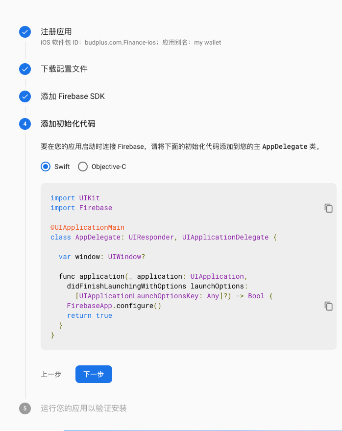

# Firebase

## what is
Firebase, bought by Google in 2014, enables realtime databases, extensive authentication and authorization, and even for deployment  
[firebase](firebase.google.com)

## usage


## how to use
[official doc of firebase](https://firebase.google.com/docs?authuser=0)

### ios app
[Setup steps](https://firebase.google.com/docs/ios/setup?hl=zh-cn)  


### android app
### react native
[firebase react Native](https://rnfirebase.io/)
### web app

`npm i firebase`

``` js
import app from 'firebase/app';
app.initializeApp(config);
```
#### use google oauth to login your app
config in firebase dashboard `Authentication` -> `Sign-in method`  
`import 'firebase/auth';`  
`app.auth()` return authentication related instance have method:
`createUserWithEmailAndPassword(email, pwd)`  
`signInWithEmailAndPassword(email, pwd)`  
`signOut()`  
`sendPasswordResetEmail()`  
`currentUser.updatePassword(password)`  
#### session management
not grasp yet

#### realtime database
`import 'firebase/database';`  
`app.database()` return database related instance have method:  
```js
ref(`users/${uid}`)
ref('users')
```


ref: 
[react plus firebase](https://www.robinwieruch.de/complete-firebase-authentication-react-tutorial)
