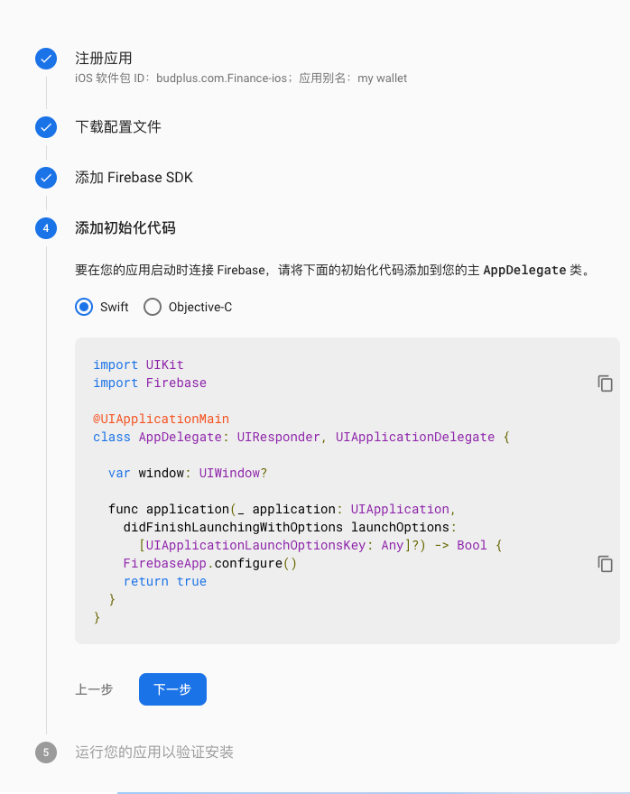

# Firebase

## what is
Firebase, bought by Google in 2014, enables realtime databases, extensive authentication and authorization, and even for deployment  
[firebase](firebase.google.com)

## usage


## how to use
[official doc of firebase](https://firebase.google.com/docs?authuser=0)

### ios app
[Setup steps](https://firebase.google.com/docs/ios/setup?hl=zh-cn)  


### android app
### react native
[firebase react Native](https://rnfirebase.io/)
### web app

`npm i firebase`

``` js
import app from 'firebase/app';
app.initializeApp(config);
```
#### use google oauth to login your app
config in firebase dashboard `Authentication` -> `Sign-in method`  
`import 'firebase/auth';`  
`app.auth()` return authentication related instance have method:
`createUserWithEmailAndPassword(email, pwd)`  
`signInWithEmailAndPassword(email, pwd)`  
`signOut()`  
`sendPasswordResetEmail()`  
`currentUser.updatePassword(password)`  
#### session management
not grasp yet

#### realtime database
`import 'firebase/database';`  
`app.database()` return database related instance have method:  
```js
ref(`users/${uid}`)
ref('users')
```


ref: 
[react plus firebase](https://www.robinwieruch.de/complete-firebase-authentication-react-tutorial)

---

Steps:
1. `npm install --save @react-native-firebase/app  ` 
2. ios setup  
2.1 Download the GoogleService-Info.plist file.  
2.2 add it to project  
2.3 open your /ios/{projectName}/AppDelegate.m file  
2.4 #import <Firebase.h>  
2.5 Within your existing didFinishLaunchingWithOptions method  
2.6  `[FIRApp configure];`  
3. Autolinking & rebuilding  
3.1 `cd ios/`  
3.2 `pod install --repo-update`  
3.3 `cd ..`  
3.4 `npx react-native run-ios`  

issue about `recordError` not work
https://github.com/invertase/react-native-firebase/issues/3594

analytics
1. predefined event
2. customize event need set params in console
3. didn't show instantly
4. can't check detail params in log, may need big query

crashlytics
1. log
2. set attributes
3. native crash mock
4. real crash
5. record error
6. send data when app first launch(kill and reopen)
7. firebase api `https://reports.crashlytics.com` `-- method: post`

