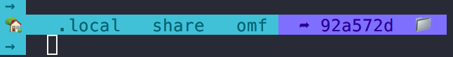
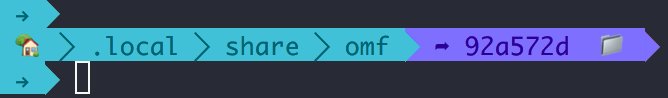
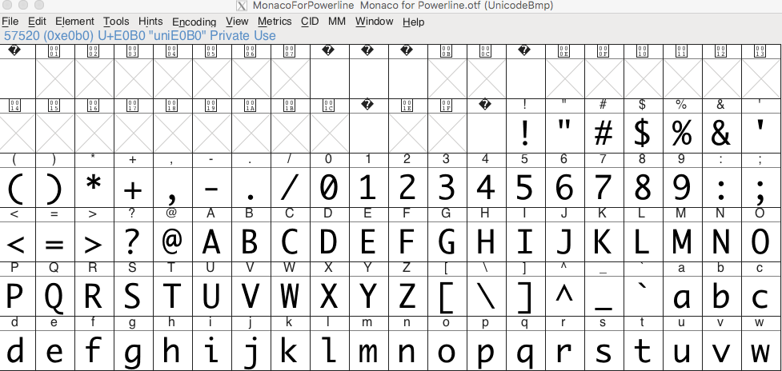
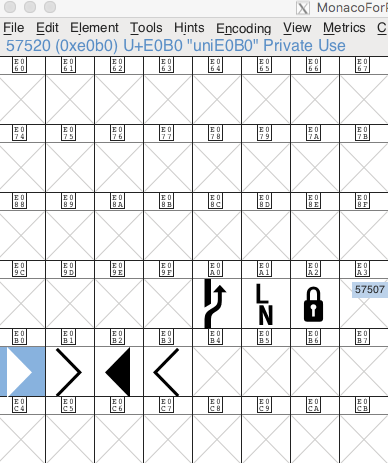

I got problem using alacrity.
theme display is not complete:

I thought it problem of alacrity, because it's display normal in iterm2:


it's font problem.

I check fish's config of the theme i'm adapting, like this:
```sh
     set segment_separator \uE0B0
     set segment_splitter \uE0B1
     set right_segment_separator \uE0B0
```
this is included in `prompt`. but the unicode `E0XX` is preserved for customized font. it i want to display right graph, I need install appropriate font on my mac.

I check my mac at `~/Library/Fonts`, I do have such font called `Monaco for PowerLine.otf`, but in my alacrity's config, it looks like:
```yml
font:
    # Normal (roman) font face
    normal:
      # Font family
      #
      # Default:
        # - (macOS) Menlo
      #   - (Linux/BSD) monospace
      #   - (Windows) Consolas
      # family: SauceCodePro Nerd Font
      # family: CodeNewRoman Nerd Font
      # family: RobotoMono Nerd Font
      # family: Hack
      # family: JetBrains Mono
      # family: UbuntuMono Nerd Font
      # family: TerminessTTF Nerd Font
      family: Monofur Nerd Font

      # The `style` can be specified to pick a specific face.
      style: Regular
```
I don't have `Monofur Nerd Font`, but it's doesn't raise the problem. Just not work when display font graph. There listed lots of font family, but I have none of them installed (LOL).

Then I set family to `monaco for powerline`, it displays normally.

mac have application called `Font Book` can check all fonts installed in your mac.  
`FontForge` is an application of font. Mail used to create font. You can use it to check the details of installed font. it can display the graph at special unicode, including all unicode.

Detail of font `Monaco for PowerLine`:  


see the first 128 characters, aka, ascii.

This is what's graph at `E0B0`, Which is used by fish's prompt config:


There is a open source font project [nerd font](https://github.com/ryanoasis/nerd-fonts). 