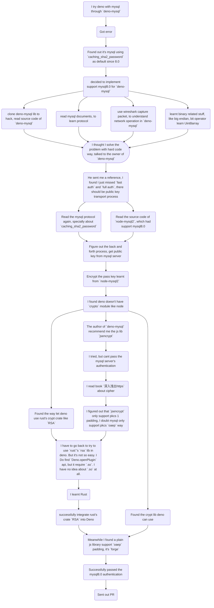
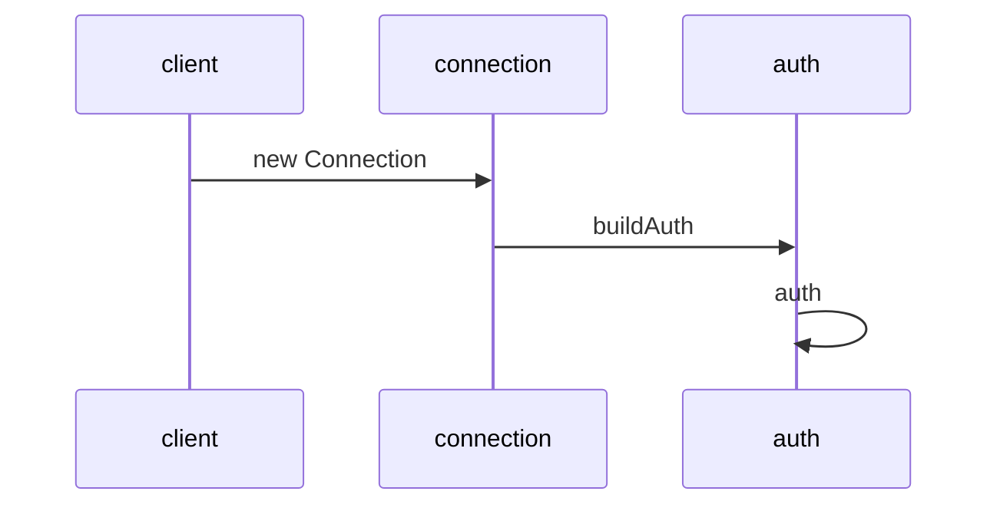
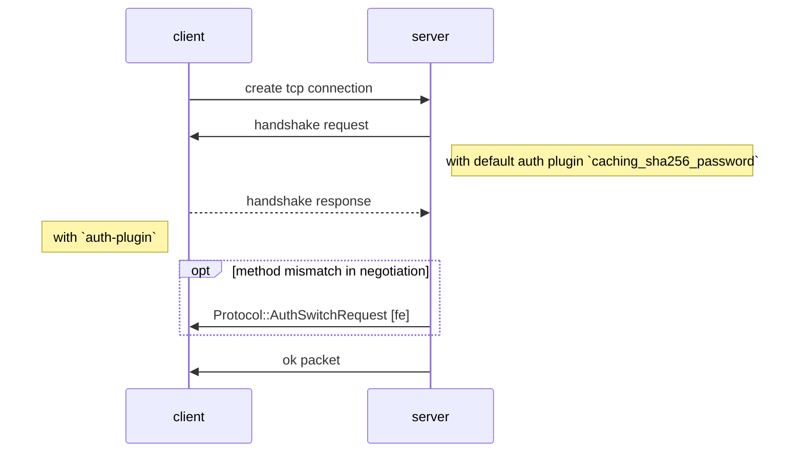
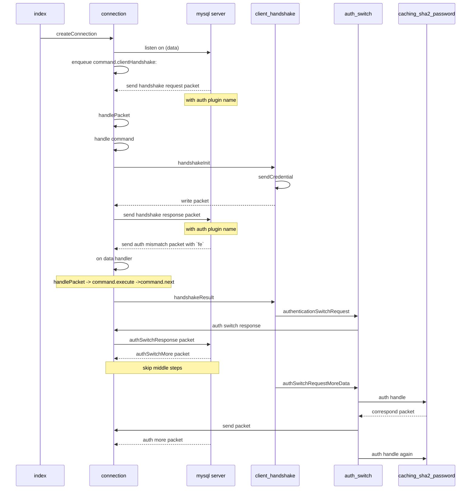
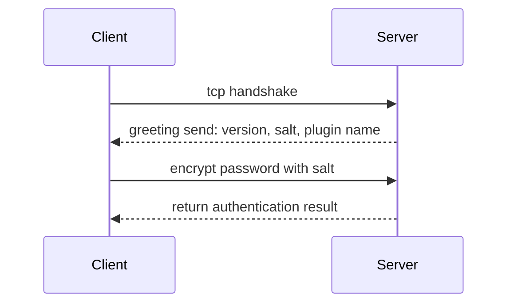

## The knowledge I got in the whole process

### The roadmap of this trip


### the process graph
#### deno-mysql
`new Client` create an instance
`connect()` -> `createConnection()` -> `new Connection()`
create `Connection` instance
invoke `connect()` -> `_connect()` -> `Deno.connect()` -> `nextPacket()` -> `parseHandshakePacket()` -> `buildAuth()`
`buildAuth()`
if password true, call `auth()`
handle password base on `authPluginName`


#### node-mysql2





#### mysql authentication
##### plugin name: `mysql_native_password`



##### plugin name: `caching_sha2_password
##### capability flag
|flag|binary|
|--|--|
|CLIENT_LONG_PASSWORD|00000000 00000000 00000000 00000001|
|CLIENT_FOUND_ROWS|00000000 00000000 00000000 00000010|
|CLIENT_LONG_FLAG|00000000 00000000 00000000 00000100|
|CLIENT_CONNECT_WITH_DB|00000000 00000000 00000000 00001000|
|CLIENT_NO_SCHEMA|00000000 00000000 00000000 00010000|
|CLIENT_COMPRESS|00000000 00000000 00000000 00100000|
|CLIENT_ODBC|00000000 00000000 00000000 01000000|
|CLIENT_LOCAL_FILES|00000000 00000000 00000000 10000000|
|CLIENT_IGNORE_SPACE|00000000 00000000 00000001 00000000|
|CLIENT_PROTOCOL_41|00000000 00000000 00000010 00000000|
|CLIENT_INTERACTIVE|00000000 00000000 00000100 00000000|
|CLIENT_SSL|00000000 00000000 00001000 00000000|
|CLIENT_IGNORE_SIGPIPE|00000000 00000000 00010000 00000000|
|CLIENT_TRANSACTIONS|00000000 00000000 00100000 00000000|
|CLIENT_RESERVED|00000000 00000000 01000000 00000000|
|CLIENT_SECURE_CONNECTION|00000000 00000000 10000000 00000000|
|CLIENT_MULTI_STATEMENTS|00000000 00000001 00000000 00000000|
|CLIENT_MULTI_RESULTS|00000000 00000010 00000000 00000000|
|CLIENT_PS_MULTI_RESULTS|00000000 00000100 00000000 00000000|
|CLIENT_PLUGIN_AUTH|00000000 00001000 00000000 00000000|
|CLIENT_CONNECT_ATTRS|00000000 00010000 00000000 00000000|
|CLIENT_PLUGIN_AUTH_LENENC_CLIENT_DATA|00000000 00100000 00000000 00000000|
|CLIENT_CAN_HANDLE_EXPIRED_PASSWORDS|00000000 01000000 00000000 00000000|
|CLIENT_SESSION_TRACK|00000000 10000000 00000000 00000000|
|CLIENT_DEPRECATE_EOF|00000001 00000000 00000000 00000000|

### knowledge
### TypedArray
ArrayBuffer是一块内存，比如var buf = new ArrayBuffer(1024)，就等于开辟了一块1kb大小的内存，但是你不能通过buf变量的索引去操作这块内存，比如console.log(buf[0])得到的是undefined，如果buf[0]=77,进行赋值操作，只是在buf对象上添加了一个属性名为‘0’的属性，并没有改变内存块中第一个字节的数据，如果想操作内存块中的数据，可以通过var int8= new Int8Array(buf)然后通过int8[0]=12;来操作这块内存中的数据，也可以用Int16Array(buf)，Int32Array(buf)等，传入的是同一块内存块的引用则操作同一块内存块，剩下的自己理解吧。


为什么存在：javaScript与显卡通信的时候，大量的实时的数据交互，用文本格式需要进行格式转化，二进制则省去转化时间。

二进制数组由三类对象组成：

ArrayBuffer对象：代表内存之中的一段二进制数据，本身不能直接操作内存，需要通过“视图”进行操作。“视图”部署了数组接口，这意味着，可以用数组的方法操作内存。
TypedArray视图：共包括 9 种类型的视图，比如Uint8Array（无符号 8 位整数）数组视图, Int16Array（16 位整数）数组视图, Float32Array（32 位浮点数）数组视图等等。
DataView视图：可以自定义复合格式的视图，比如第一个字节是 Uint8（无符号 8 位整数）、第二、三个字节是 Int16（16 位整数）、第四个字节开始是 Float32（32 位浮点数）等等，此外还可以自定义字节序。


和数组的区别 TypedArray内的成员只能是同一类型 TypedArray成员是连续的，不会有空位 TypedArray成员的默认值为0，数组的默认值为空 TypedArray只是视图，本身不存储数据，数据都存储在底层的ArrayBuffer中，要获取底层对象必须使用buffer属性 TypedArray可以直接操作内存，不需要进行类型转换，所以比数组快 TypedArray数组有的方法都可以使用，但不能使用cancat方法

DataView视图提供更多操作选项，而且支持设定字节序。本来，在设计目的上，ArrayBuffer对象的各种TypedArray视图，是用来向网卡、声卡之类的本机设备传送数据，所以使用本机的字节序就可以了；而DataView视图的设计目的，是用来处理网络设备传来的数据，所以大端字节序或小端字节序是可以自行设定的。 大端字节序和小端字节序，x86体系的计算机都使用小端字节序，123456中12比较重要，所以排在后面，存储顺序是563412。大端则相反  

视图的构造函数接受三个参数，第一个ArrayBuffer对象，第二个视图开始的字节号（默认0），第三个视图结束的字节号（默认直到本段内存区域结束）

const buffer = new ArrayBuffer(12);
const a = new Uint8Array(buffer, 0, 1); // 以Uint8Array读取第一个字节
a[0] = 1;
const b = new Int32Array(buffer, 1, 2); // 以Int32Array读取第二个字节
b[0] = 2;

[二进制数组](https://javascript.ruanyifeng.com/stdlib/arraybuffer.html)
```binary
02000002 01030700 00030000 00020000 00
```
### big endian and little endian

mysql ` Protocol::HandshakeResponse: packet` is little endian? big endian can't match

[二进制的经典应用-标志位与掩码](https://www.jianshu.com/p/5c352d83e57c)
[“字节序”网络中的大小端问题](https://juejin.im/post/5eaf96666fb9a0432d76c6a9)
[理解字节序](https://www.ruanyifeng.com/blog/2016/11/byte-order.html)
[How to teach endian](https://blog.erratasec.com/2016/11/how-to-teach-endian.html)

网络字节顺序是TCP/IP中规定好的一种数据表示格式，它与具体的CPU类型、操作系统等无关，从而可以保证数据在不同主机之间传输时能够被正确解释。网络字节顺序采用big endian排序方式。
[网络序？本地序？傻傻分不清楚。。。](https://imweb.io/topic/57fe263b2a25000c315a3d8a)

[Oreilly official](https://www.oreilly.com/)

### bit operator 

### encrypt with rsa
need to use RSA encrypt
#### learn about RSA more
[RSA算法原理1](https://www.ruanyifeng.com/blog/2013/06/rsa_algorithm_part_one.html)
[RSA算法原理2](http://www.ruanyifeng.com/blog/2013/07/rsa_algorithm_part_two.html)
[node crypto](https://www.liaoxuefeng.com/wiki/1022910821149312/1023025778520640)

### References:

#### mysql documents
[ref mysqljs](https://github.com/mysqljs/mysql/pull/2233/files?file-filters%5B%5D=.js&file-filters%5B%5D=.key&file-filters%5B%5D=.yml&w=1)  
[official mysql module](https://dev.mysql.com/doc/dev/connector-nodejs/8.0/)  
[mysql blog](https://mysqlserverteam.com/mysql-8-0-4-new-default-authentication-plugin-caching_sha2_password/)
[official mysql doc -- protocol part](https://dev.mysql.com/doc/dev/mysql-server/8.0.12/page_protocol_basics.html)   
[another version??? official mysql doc -- protocol part](https://dev.mysql.com/doc/internals/en/mysql-packet.html)  
[official deno doc](https://doc.deno.land/https/github.com/denoland/deno/releases/latest/download/lib.deno.d.ts#Deno.connect)
[interpreter of caching_sha2_password, if i saw this earlier would better](https://dev.mysql.com/doc/dev/mysql-server/8.0.12/page_caching_sha2_authentication_exchanges.html#sect_caching_sha2_info)

[another doc](https://mariadb.com/kb/en/caching_sha2_password-authentication-plugin/)

原来官方文档里面有 example 啊， 早翻到的话，节省不少时间哇  
[Protocol Examples](https://dev.mysql.com/doc/internals/en/client-wants-native-server-wants-old.html)

#### others
[Web Crypto API](https://developer.mozilla.org/en-US/docs/Web/API/SubtleCrypto/encrypt)
[GPG入门教程](https://www.ruanyifeng.com/blog/2013/07/gpg.html)

[explanation of this 0103 packet- auth more data ](https://dev.mysql.com/doc/internals/en/successful-authentication.html)

[a blog about protocol stuff](https://promacanthus.netlify.app/experience/mysql/08-%E5%8D%8F%E8%AE%AE%E8%A7%A3%E6%9E%90-%E8%BF%9E%E6%8E%A5%E9%98%B6%E6%AE%B5/)

[another lib node-mysql2](https://github.com/sidorares/node-mysql2/tree/feature/fast-caching_sha2_password)


[sample of Understanding MySQL INternals by Sasha Pachev](https://www.oreilly.com/library/view/understanding-mysql-internals/0596009577/ch04.html)

very nice article, concise  
[Writing MySQL Proxy in GO for self-learning](https://medium.com/@alexanderravikovich/writing-mysql-proxy-in-go-for-learning-purposes-part-2-decoding-connection-phase-server-response-7091d87e877e)  

---

25 May I heard the news thant Deno had been released formally. So I decided to have a try. 

My plan is simple.Just build a simple server which can expose a single api and can persist data to database. [this](https://github.com/Demo-of-Arbitrary/Deno) is my demo repository. I almost got there, but when I tried to use mysql with `deno-mysql` I got trouble. 

Since I already have two stranger friends: `Deno` and `typescript`, I heard a lot about `typescript`, but didn't got chance to practice in my own project. Now I have to handle `Mysql` stuff. I barely learn some `mysql` at the first time I learnt coding by myself, about 6 years ago. So I had to go through the mysql document and some books of basic mysql knowledge, as well as wrote down some notes.

After those quick learning, I can setup a mysql server and execute simple sql. Next I tried to connect to the mysql server through `deno-mysql`. But it refused to work although I had followed every step. Then I had to go through the issue of `deno-mysql`'s repo. Then I found an explanation that `deno-mysql` can't support `caching_sha2_password` which become the default auth plugin since mysql 8.0. Then I go back to check my mysql version. It's 8.0. It's very unlucky.

I should stopped at there, but somehow, an idea hit me that why don't I help to contribute to the `deno-mysql` repo to implement the function of supporting the `caching_sha2_password` authentication mechanism. I didn't know what a big task that will be. I just started.

I started from reading the source code of the `deno-mysql`. It's not difficult to me because I'm an experienced front end developer. Quickly I thought I found out the problem, the author did "complete" the `caching_sha2_password` but he comment that part of code. I don't know why, just try to uncomment them to see how it will go.

It turned out that I was too optimistic. That doesn't work, and what's worse I was trapped. I didn't know how to do it because lack of related knowledge. I did have an idea, to inspect the network. But I wasn't familiar with capture tool such as `wireshark`. I used it severally but hadn't grasp it well. I

Then I decided to turn to learn `wireshark` and went back later. I read some books and online articles. I finally figure out what the packets represented, only for the tcp handshake and disconnect. But there were some others packets I totally had no ideas.

I guess them about the mysql protocol. I google and found the mysql official documents,and read the protocol part. I had to say, this part is different to me. Because this was the first time I handle protocol related stuff. It's abstract and without detailed example. 
Then when I tried to program, it became worse. Because I didn't  handled Binary stuff. I had to learn that part also. I know binary but it's difficult to use them to real scenery. 

I learnt a lot new stuff in this process. I had to test and verified and read the official documents again and again. Because I have bad habit of skip often when reading. I always missed the key point and have to go back when I suffered trouble. Stupid me. And the most lesson I learnt is asking people. If you want to solve every problem by yourself, you will just push yourself crash. It's not shame admit people smart than you.

I learn these knowledge:

1. mysql protocol's packet structure, the first 3 bytes is the length, the 4th is sequence id. 
2. mysql handshake preprocess. the document had detailed explained, but I missed it at first. Finally google bring me back to there :)
3. the big endian and little endian when storage and transport binary. I never heard it before.
4. the RSA encryption. For grasp this I read two books, learn a lot. `C = P^3 mod n`, encryption is just math.
5. I also learn encode and decode. Although we say encrypt these texts, but computer refused to storage them, it persist them as binary. so we need encode system, such as `ascii` `unicode`. I had deeper understanding of encode.
6. base64

But I was trapped here again. Because I found there is no deno lib to encrypt like `crypto` in nodejs. I felt desperate. I thought I should quit. Because I had spent too much time on this. But I knew, if i quit i will got nothing. All I learnt I will forget them. If I can't make a thing, that's same as I did noting. 

So I went on. I ask help. some one give me idea to use js lib `jsencrypt`. I tried but it didn't support RSA's `oaep` padding. I decide to turn to RSA. Because I knew Deno was written by `Rust`. Like nodejs can use c++ lib, deno should can use `Rust` lib also.

Again I stepped into a totally strange area. I would never do that any more. I tried to learnt `Rust` from scratch and  I got many trouble. Never involved so many thing you totally not know. 

At last I made it. I used the deno bridge to adapt rust's `RSA` crate. and i also happened to find a js lib `forge` it works well. I got two availabl options. I choose the `forge`.

I almost success.I had a lib `node-mysql2`. I ref this lib. It help me do things smoothly. But at last step, I encrypt the password with public key, mysql server still cant handshake with my code. Again I thought I should quit. Because I thought I almost do exactly every step as `node-mysql`. But I didn't quit. That's me, never gave up. I again compare my code with `node-mysql2`. And analyze the packets with wireshark. Then modify one factor and verified. I believe exclude every impossible, the left one is the truth.

Finally i solved the problem. It's encode problem.

I make a pr to the `deno-mysql` at last. At that moment, I felt endless happy.
