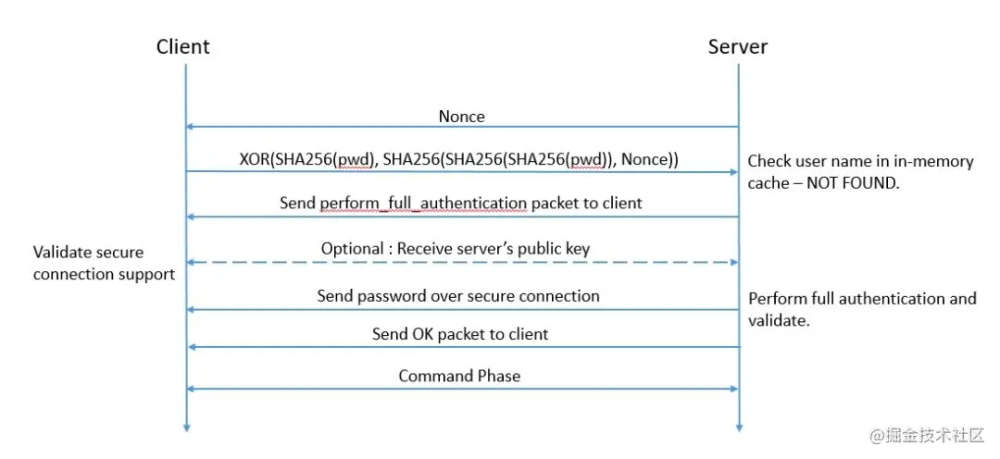
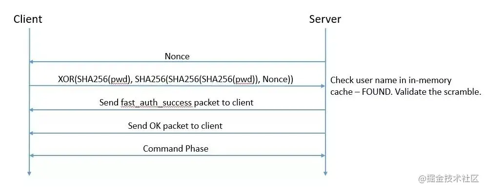

# Mysql protocol
## [Define packet](https://dev.mysql.com/doc/internals/en/mysql-packet.html)

| Type        | Name                              |
| ----------- | --------------------------------- |
| int<3>      | payload_length                    |
| int<1>      | sequence_id                       |
| string<var> | payload, length is payload_length |

i.e. :
|                                                 |                                                          |
| ----------------------------------------------- | -------------------------------------------------------- |
| <ins>01 00 00</ins> <ins>00</ins> <ins>11</ins> | * length: 1   * sequence_id: x00   * payload: 0x11 |

## User table
This table keep the auth plugin for use, as default, mysql5.6 use `mysql_native_password`, mysql8.0 use `caching_sha2_password`  

## sha1 sha256 区别
长度

## mysql_native_password 的登录认证过程
都是基于challenge-response，不需要直接对密码校验，校验加密后的密文  
1. 服务端存储的是两次sha1加密的密码`SHA1(SHA1(password))`  
2. 客户端发送的是`response=HEX(SHA1(password) ^ SHA1(challenge + SHA1(SHA1(password))))`
3. 服务器收到后， 先计算出`SHA1(challenge + SHA1(SHA1(password))))`,那么`SHA1(password)=response^ SHA1(challenge + SHA1(SHA1(password))))`,最后再对`SHA1(password)`求一次sha1和`SHA1(SHA1(password))`进行比对，一致表示认证成功。

细节参考这篇文章[Mysql是如何做到安全登陆](https://zhaoyanblog.com/archives/1002.html)
## caching_sha2_password  的登录认证过程

## 为什么要改进
1. sha1 的安全性随着破解计算力的增加而变低
2. 用sha2可以保证安全，但是每次认证如果安全按照`mysql_native_password` 的challenge-response来的话，server的计算量太大，耗时多。所以才要想办法在保证安全的前提下明文传输密码。或者是通过安全的通道，或者是非安全通道下用RSA加密的方式
3. 这样的话`sha2_password`的认证速度也可以接受了，但是为了更快，可以再做一次缓冲
参考：[Why did we do it?caching_sha2_password](https://mysqlserverteam.com/mysql-8-0-4-new-default-authentication-plugin-caching_sha2_password/)

## Process
### [Handshake](https://dev.mysql.com/doc/internals/en/connection-phase-packets.html#packet-Protocol::Handshake)
For 4, Handshake initial:  
send packet with these: mysql version, auth plugin: mysql_native_password, capability, scramble

For 5, Handshake response
send packet with these:  user name, password 

caching_sha2_password process

```mermaid
sequenceDiagram
    autonumber
    participant client
    participant server
    rect rgb(0, 100, 100)
    Note over client,server: TCP handshake 
    client->>server: Seq=3388(relative 0)
    server->>client: Seq=4477(relative 0) Ack=3389(relative 1)
    client->>server: Seq=3389(relative 1) Ack=4478(relative 1)
    end
    rect rgb(100, 100, 0)
    Note over client,server: Mysql Connection Phase
        rect rgb(50, 50, 0)
        Note over client,server: Handshake
            server->>client: Handshake initial
            client->>server: Handshake response
        end

        server->>server: Check cache

        alt is Fast path
        server->>client: OK packet. Jump to Command Phase
        else is Full auth
            rect rgb(50, 50, 0)
                server->>client: Auth more packet
                client->>server: request public key
                server->>client: public key
                client->>server: Encrypt password with public key
                server->>client: OK packet
            end
        end
    end
    rect rgb(100, 0, 100)
    Note over client,server: Mysql Command Phase
        client->>server: SQL command like `show databases`
    end
```

