# Mysql protocol
## [Define packet](https://dev.mysql.com/doc/internals/en/mysql-packet.html)

|Type | Name |
|-|-|
|int<3>|payload_length|
|int<1>|sequence_id|
|string<var>|payload, length is payload_length|

i.e. :
|||
|--|--|
|<ins>01 00 00</ins> <ins>00</ins> <ins>11</ins>|* length: 1   * sequence_id: x00   * payload: 0x11|

## User table
This table keep the auth plugin for use, as default, mysql5.6 use `mysql_native_password`, mysql8.0 use `caching_sha2_password`  

## sha1 sha256 区别
长度

## Process
### [Handshake](https://dev.mysql.com/doc/internals/en/connection-phase-packets.html#packet-Protocol::Handshake)
For 4, Handshake initial:  
send packet with these: mysql version, auth plugin: mysql_native_password, capability, scramble

For 5, Handshake response
send packet with these:  user name, password 

```mermaid
sequenceDiagram
    autonumber
    participant client
    participant server
    rect rgb(0, 100, 100)
    Note over client,server: TCP handshake 
    client->>server: Seq=3388(relative 0)
    server->>client: Seq=4477(relative 0) Ack=3389(relative 1)
    client->>server: Seq=3389(relative 1) Ack=4478(relative 1)
    end
    rect rgb(100, 100, 0)
    Note over client,server: Mysql Connection Phase
        rect rgb(50, 50, 0)
        Note over client,server: Handshake
            server->>client: Handshake initial
            client->>server: Handshake response
        end

        alt is Auth passed
        server->>client: OK packet. Jump to Command Phase
        else is Auth more
            rect rgb(50, 50, 0)
                server->>client: Auth more packet
                client->>server: request public key
                server->>client: public key
                client->>server: Encrypt password with public key
                server->>client: OK packet
            end
        end
    end
    rect rgb(100, 0, 100)
    Note over client,server: Mysql Command Phase
        client->>server: SQL command like `show databases`
    end
```

