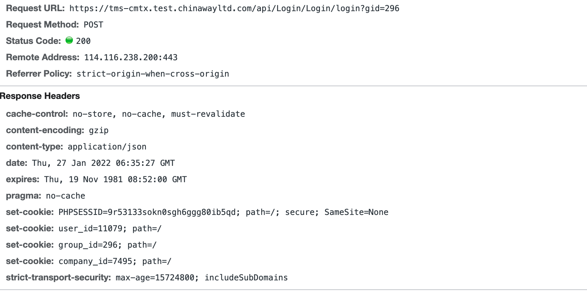

HTTP

## cookie

问题始于，我好奇为啥跨域发送请求时，

qiji56.test.chinawayltd.com下的cookie没有被发送呢，即使我已经开了`withCredential:true`, `access-control-allow-credential: true` header 也已经设置了

其实很简单，我打开的网站是https://qiji56.test.chinawayltd.com/，种在自己域名下的cookie，只有自己可见。默认setcookie如果不设置domain，就是种在自己的域名下。

后来我把其中一个cookie的域名设在了`.test.chinawayltd.com`下就可以带过去了

参考了这篇文章：[Cookie顶级域名、二级域名、三级域名共享](https://blog.csdn.net/supermao1013/article/details/83827310)

这种针对跨域请求的，跨域请求想要带cookie过去，需要客户端设置`withCredential: true`, 并且服务端设置`access-control-allow-credentia: true`.

但是对于跨站请求，需要设置`SameSite: None`, 否则是不能带cookie的，现在chrome的最近几个版本都将这个默认值设成了`Lax`, 如果没有显式的设置的话。即默认是跨站发送请求带不了cookie的。这个是为了阻止跨站请求伪造。

Chrome 浏览器不能设置user-agent请求头，不论是fetch还是axios。还有一些头也是不能设置的，看这儿

https://developer.mozilla.org/en-US/docs/Glossary/Forbidden_header_name

尽管现在UA被移出了这个黑名单，但是chrome一直没能修复这个bug，https://bugs.chromium.org/p/chromium/issues/detail?id=571722。

stackoverflow上有相关问题：

https://stackoverflow.com/questions/33143776/ajax-request-refused-to-set-unsafe-header

axios的github也有issue：

https://github.com/axios/axios/issues/1231