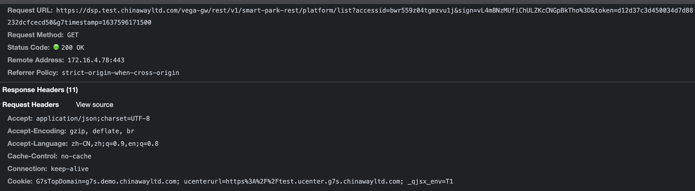

HTTP

## cookie

问题始于，我好奇为啥跨域发送请求时，

qiji56.test.chinawayltd.com下的cookie没有被发送呢，即使我已经开了`withCredential:true`, `access-control-allow-credential: true` header 也已经设置了

其实很简单，我打开的网站是https://qiji56.test.chinawayltd.com/，种在自己域名下的cookie，只有自己可见。默认setcookie如果不设置domain，就是种在自己的域名下。

后来我把其中一个cookie的域名设在了`.test.chinawayltd.com`下就可以带过去了

参考了这篇文章：[Cookie顶级域名、二级域名、三级域名共享](https://blog.csdn.net/supermao1013/article/details/83827310)