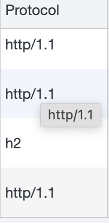
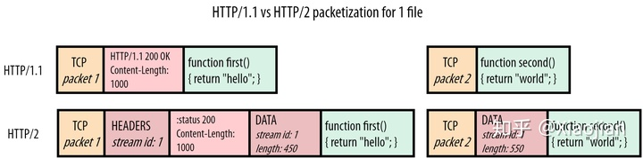

#  HTTP2.0

Chrome 控制台查看http2.0, `h2` stands for HTTP/2.

一个http2的demo网站https://http2.akamai.com/demo/h2_demo_frame.html

### 二进制分帧层

1.1响应是文本格式，而2.0把响应划分成了两个帧，图中的HEADERS（首部）和DATA（消息负载） 是帧的类型

可以用wireshark抓包来看细节

### 多路复用

HTTP/1.1的队头阻塞问题

一个tcp连接只能完整传输完一个资源后再传输另一个，比如传输完a.js才能传输b.css。如果a.js很大，就阻塞了后面要请求的资源。尽管

一个浏览器针对一个域名最大能建立6个tcp连接，但很是不够，所以人们想了办法，把资源放在多个域名上，比如cdn。

这个讲得很透彻[关于队头阻塞（Head-of-Line blocking），看这一篇就足够了](https://zhuanlan.zhihu.com/p/330300133)

如果我们可以将每个文件的有效荷载（header）分成更小的片（pieces）或“块”（chunks），我们就可以在网络上混合或“交错”（interleave）这些块：为 JS 发送一个块，为 CSS 发送一个块，然后再发送另一个用于 JS，等等，直到文件被下载为止。使用这种方法，较小的CSS文件将更早地下载（并且可用），同时只将较大的JS文件延迟一点。这就是多路复用。

为啥http1.1不能用这种交替的方式呢，因为http1.1的response是文本，无法判断是否结束，是否开始。而http2.0的response是数据帧，其中有数据的id和这个包数据内容的长度。如下图：

**http的keep-alive又起了什么作用呢?** 

在 HTTP 1.0 中默认是关闭的，如果浏览器要开启 Keep-Alive，它必须在请求的包头中添加`Connection: Keep-Alive`

**从 HTTP 1.1 开始， 就默认是开启了 Keep-Alive**，如果要关闭 Keep-Alive，需要在 HTTP 请求的包头里添加：`Connection:close`

Keep-Alive 也叫 HTTP 长连接, 使用了 HTTP 长连接，如果客户端完成一个 HTTP 请求后，就不再发起新的请求，此时这个 TCP 连接一直占用着不是挺浪费资源的吗？为了避免资源浪费的情况，web 服务软件一般都会提供 `keepalive_timeout` 参数，用来指定 HTTP 长连接的超时时间。比如设置了 HTTP 长连接的超时时间是 60 秒，web 服务软件就会**启动一个定时器**，如果客户端在完后一个 HTTP 请求后，在 60 秒内都没有再发起新的请求，**定时器的时间一到，就会触发回调函数来释放该连接。**

不知道这两个超时是什么，net::ERR_TIMED_OUT net::ERR_CONNECTION_TIMED_OUT，从waterfall看，前面是18s，后面是1min

[面试官：TCP Keepalive 和 HTTP Keep-Alive 是一个东西吗？](https://bbs.huaweicloud.com/blogs/285330)

### 头部压缩

HPACK压缩

用了动态字典和静态字典（含常见的头部名称，以及常见的头部名称和值的组合），加Huffman编码，第二次传送就只传一个字节的编码

### 服务器端推送

这个跟消息推送不一样，推送的是资源。比如客户端请求index.html，服务器端发现里面会请求script.js和style.css，就能够额外推送script.js和style.css，不用等index.html发送完就可以推送资源

> 服务器会发送一个PUSH_PROMISE帧，客户端可以通过发送RST_STREAM帧来拒绝推送（当资源已经位于缓存）。这一步的操作先于父响应（index.html），客户端了解到服务器端打算推送哪些资源，就不会再为这些资源创建重复请求。当客户端收到index.html的响应时，script.js和style.css已经位于缓存。

从这里摘抄的[面试官问：你了解HTTP2.0吗？](https://juejin.cn/post/6844903734670000142#heading-7)