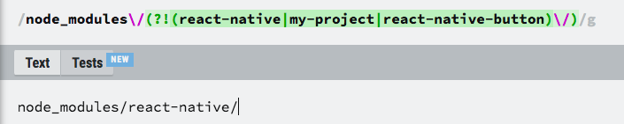
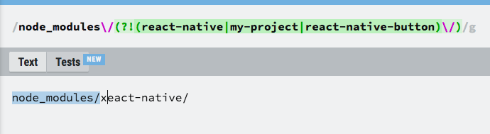

## advanced
### Lookahead assertion
`pattern(?=some_pattern)`
### Negative lookahead assertion
`pattern(?!some_pattern)`

Always cant remember these, but this time, I got better understand. `()` is not only means capture, added a `?` `(?)` means assertion

    /Jack(?=Sprat|Frost)/ matches "Jack" only if it is followed by "Sprat" or "Frost". However, neither "Sprat" nor "Frost" is part of the match results.

Noted, it's not part of match, i.e.:

highlighted with blue is the match, it's not include what is in `(?!)`, they are just condition, not content.

refs:
[MDN Regular_Expressions](https://developer.mozilla.org/en-US/docs/Web/JavaScript/Guide/Regular_Expressions)
[正则表达式](https://developer.mozilla.org/zh-CN/docs/Web/JavaScript/Guide/Regular_Expressions)

## tool
[online visualized tool](https://regexr.com/)
[online visualized tool2](https://regex101.com/)