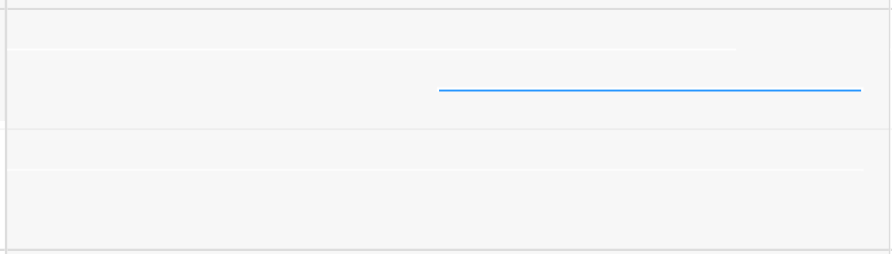
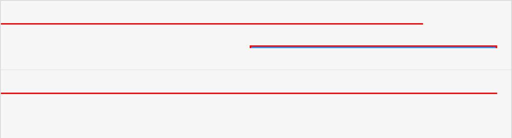
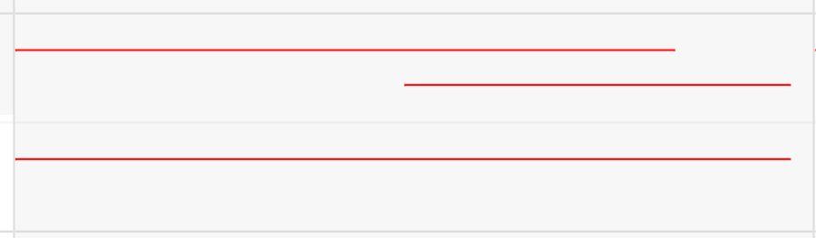

# A story from a bug

Recently qa reported an issue:

when create a one minute reservation on calendar, it will not displayed on the calendar. I realized it's should be an interesting question and decide to dig it deeply.

Firstly, I narrow the problem's scope. Nothing about backend and it happens on some special time range. E.g. x:10-x:11. And in fact it's not displayed, it just becomes white and meld with white background. 

Think about x:30-x:31 works fine. I compare them and find out that it's the white border when it looks disappear. And both the two elements(x:10-x:11 & x:30-x:31) has same size, height both `1.666px`. and merely difference is `top`. 

change from `top: 43.0566%`

to `top: 43.0266%`

the P1 rendered height is 2px, P2 rendered height is 1px. 

So I guess it's about browser can't handle fractional properly.

After some google effort, I find that it's the problem called `sub-pixel`.

In conclusion, modern browser can't render fractional pixel, but they do calculate with accurate number.

refs:
1. [Determination of algorithms used for percentage based rounding divs on browsers and CSS Frameworks](http://web.archive.org/web/20110309203035/http://elasticss.com/determination-of-algorithms-used-for-percentage-based-rounding-divs-on-browsers-and-css-frameworks/)