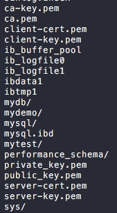

# Mysql

- [Mysql](#mysql)
  - [Basic usage](#basic-usage)
    - [show metadata](#show-metadata)
    - [create database](#create-database)
    - [remove table](#remove-table)
    - [privilege](#privilege)
      - [set empty password](#set-empty-password)
    - [others files](#others-files)
  - [GUI tools](#gui-tools)
  - [issues](#issues)
    - [[0x01]](#0x01)
    - [[0x02] what is `mysqld` and `mysqld_safe`](#0x02-what-is-mysqld-and-mysqld_safe)
    - [[0x03] start mysql by `brew services start mysql@5.7`](#0x03-start-mysql-by-brew-services-start-mysql57)
    - [[0x04] start by `mysql.server start`](#0x04-start-by-mysqlserver-start)
  - [syntax](#syntax)
  - [my.cnf](#mycnf)

## Basic usage
### show metadata
`show databases;`
`use <db_name>;`
`show tables;`
`select database();`
`status;`
### create database
`create database <dbname>`
`create table <>`
### remove table
`delete from <table>` 

### privilege

`mysql` a client to connect to database
`mysql -h 127.0.0.1 -P 3306 -uroot -D mysql`
1. `-u` and `-p` space issue
2. with `-h` and `-P` will use tcp model to connect, wireshark can capture packet
3. without `-h`(even using `-P`) will not use tcp, use unix socket to connect server. wireshark cannt capture packet.It's defined in `my.cnf` and may encounter error [issues 1]([id001])

`CREATE USER yzj@'%' IDENTIFIED BY 'yinzhengjie';`    
`CREATE USER yinzhengjie@'%' IDENTIFIED WITH mysql_native_password BY 'yinzhengjie';`  
change a password:  
`ALTER USER 'yourusername'@'localhost' IDENTIFIED WITH mysql_native_password BY 'youpassword';`

NOTE:  
  `CREATE USER empty@'%' IDENTIFIED BY 'emptypassword';` got error code`You have an error in your SQL syntax`, because `empty` is somehow a preserve keyword

`SELECT user,host,plugin FROM mysql.user;` list all users  

`GRANT ALL on *.* TO yzj@'%';` assign privilege to  
`SHOW GRANTS FOR yzj@'%';` check privilege   
`FLUSH PRIVILEGES;`将user表中信息立即同步到内存中

#### set empty password
`update user set authentication_string='' where user='wenjoy';`  
ref [this](https://stackoverflow.com/questions/32208000/update-user-password-in-mysql-5-7) but it mentioned `set password for 'jeff'@'localhost' = PASSWORD('mypass');` not work for, got syntax errorp;

if u do know the word, u can use this to change(without validate it works or not):  
`mysqladmin -u root -p'oldpassword' password ''` 

### others files
`my.cnf` location is `/usr/local/etc/my.cnf`
`error log location` is `cat /usr/local/var/mysql/ML000631695.local.err`

`/usr/local/Cellar/mysql/8.0.19_1/bin/mysqld --basedir=/usr/local/Cellar/mysql/8.0.19_1 --datadir=/Users/georgexie/workspace/projects/Finance/db --plugin-dir=/usr/local/Cellar/mysql/8.0.19_1/lib/plugin --log-error=wl005335406.active.local.err --pid-file=/Users/georgexie/workspace/projects/Finance/db/wl005335406.active.local.pid --socket=/tmp/mysql.sock --port=3306`

## GUI tools

DBeaver

## issues
### [0x01]
`ERROR 2002 (HY000): Can't connect to local MySQL server through socket '/tmp/mysql.sock' (2)
it means server is down`  
~~seems because I start create and edit `my.cnf`. and solution is add this line 
`datadir=/Users/georgexie/workspace/projects/Finance/db` to `.cnf`~~

### [0x02] what is `mysqld` and `mysqld_safe`
mysqld_safe是服务端工具，用于启动mysqld，并且是mysqld的守护进程

mysql.server脚本其实也是调用mysqld_safe脚本去启动MySQL服务器的,但此时mysqld_safe不能使用参数选项即不能mysqld_safe --defaults-file这样的模式，此时只能使用默认的/etc/my.cnf配置文件,就算是ps -ef|grep mysql显式看到的信息也只是parse_server_arguments函数指定的参数，也是来自my.cnf，相当于mysql.server把my.cnf中的参数传递给mysqld_safe，mysqld_safe再传递给mysqld，如下看到的--datadir也是来自my.cnf

mysqld_safe多长时间检测一次mysqld呢，即多长时间去把mysqld拉起

这是linux的机制，不是mysql的机制，因为mysqld_safe是父进程，mysqld是子进程，一旦子进程奔溃，linux信号机制下父进程马上就知道自己名下的子进程出问题了，会立即重新fork出一个新的子进程

mysqld的端口默认3306，mysqld_safe没有端口

### [0x03] start mysql by `brew services start mysql@5.7`
`brew services list`

```
Name       Status  User      Plist
mysql@5.7  started georgexie /Users/georgexie/Library/LaunchAgents/homebrew.mxcl.mysql@5.7.plist
```
but `mysql` cannot connect:

`ERROR 2002 (HY000): Can't connect to local MySQL server through socket '/tmp/mysql.sock' (2)`

check with `ps aux | grep mysql`, no process found

check error log at `/usr/local/var/mysql/wl000631764.active.local.err`:
```
2020-06-16T06:04:55.441751Z 0 [ERROR] Fatal error: Can't open and lock privilege tables: Table 'mysql.user' doesn't exist
2020-06-16T06:04:55.441785Z 0 [ERROR] Fatal error: Failed to initialize ACL/grant/time zones structures or failed to remove temporary table files.

```

this way will not follow my `my.cnf`

### [0x04] start by `mysql.server start`

```
 ERROR! The server quit without updating PID file (/Users/georgexie/workspace/projects/Finance/db/wl000631764.active.local.pid).
 ```
check the path, there's no `pid` file at this location. guess when I using `kill`, system didn't have chance to create it?`

meanwhile, i'm convinced that this way starting adopt my `my.cnf` config

check error log at `/Users/georgexie/workspace/projects/Finance/db/wl000631764.active.local.err`:

```
2020-06-16T06:11:16.717519Z 0 [ERROR] Fatal error: Can't open and lock privilege tables: Table 'mysql.user' doesn't exist
2020-06-16T06:11:16.717543Z 0 [ERROR] Fatal error: Failed to initialize ACL/grant/time zones structures or failed to remove temporary table files.
```

google and find solution, need initialization:

```shell
You have to initialize the data directory by running the following command

mysqld --initialize [with random root password]

mysqld --initialize-insecure [with blank root password]
```

this time I do see by myself what is the `-rw-r-----    1 georgexie  staff     4B Jun 16 14:19 ML000631695.local.pid` pid file!

Conclusion: 
Don't use `1`, use `2` to start mysql service

Going-well steps:
1. initial with `mysqld --initialize-insecure`
2. start with `mysql.server start`
3. connect with `mysql -uroot`

May encounter issues:
1. `ERROR 2002 (HY000): Can't connect to local MySQL server through socket '/tmp/mysql.sock' (2) `
2. `ERROR! The server quit without updating PID file`


I found private and public pem .etc at this location: `/var/lib/mysql/`  


## syntax
当字段名与MySQL保留字冲突时，可以用字符“`”将字段名括起来：

```select `from` from table;```

总结:在Mysql中，当表名或字段名乃至数据库名和保留字冲突时，在sql语句里可以用撇号（`）括起来。

## my.cnf
```bash
[client]
port = 3306
socket = /tmp/mysql.sock
default-character-set = utf8
# Default Homebrew MySQL server config
[mysqld]
# Only allow connections from localhost
# collation-server = utf8_unicode_ci
character-set-server = utf8
init-connect ='SET NAMES utf8'
max_allowed_packet = 64M
bind-address = 127.0.0.1
port = 3306
socket = /tmp/mysql.sock
innodb_file_per_table=1
datadir=/Users/georgexie/workspace/projects/Finance/db

[mysqld_safe]
timezone = '+0:00'
```

refs: 
1. [official doc](https://dev.mysql.com/doc/refman/8.0/en/caching-sha2-pluggable-authentication.html)
2. [protocol part](https://dev.mysql.com/doc/dev/mysql-server/8.0.12/page_protocol_basics.html)
3. [official implement of js lib to connect mysql8](https://dev.mysql.com/doc/dev/connector-nodejs/8.0/)
4. [another lib mysqljs](https://github.com/mysqljs/mysql/pull/2233/files?file-filters%5B%5D=.js&file-filters%5B%5D=.key&file-filters%5B%5D=.md)
