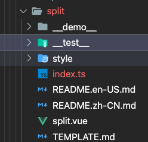

ts+js混合项目用vite库模式打包成es5，兼容老式浏览器

我最近在开发一个公司的vue组件库，用vite打包，语法用得很杂，一个组件里大概是这样，Ts,js,vue啥都有。




有天我领导找我突然说我们的组件库能不能支持老浏览器。因为有个项目出了个线上bug—白屏，就是因为用了vite，但是不兼容客户的老浏览器，后来用了`@vitejs/plugin-legacy` 解决了。他担心我们组件库也会有一样的问题，于是让我把组件库打包成兼容es5的。本来我觉得我们组件库不用去考虑兼容问题的，开发者使用我们库构建应用的时候自然会去考虑兼容问题。但是我后来我参考了几个ui库，antd是编译成es5的，arco是编译成es6的。既然antd都兼容es5了，那么我们也应该试试吧。

首先我研究了一下`@vitejs/plugin-legacy` 这个插件。vite是利用了`<script type='module' src='./a.js'` 浏览器支持esmodule这个特性的，因为ie不支持这个，所以vite天然就抛弃了ie用户。但是有很多开发者用了vite，但是必须支持ie，所以就有了`@vitejs/plugin-legacy` 这个插件https://github.com/vitejs/vite/tree/main/packages/plugin-legacy。 它做了两件事：

1. 利用system.js来模拟支持es module
2. 把es6语法转译成es5语法

配置文件是这样的：

```js
// vite.config.js
import legacy from '@vitejs/plugin-legacy'

export default {
  plugins: [
    legacy({
      targets: ['defaults', 'not IE 11']
    })
  ]
}
```

其中tagets部分很眼熟，就是browserlist，因为底层就是利用了[`@babel/preset-env`](https://babeljs.io/docs/en/babel-preset-env#targets)来把es6语法转译成es5语法

另外system.js https://github.com/systemjs/systemjs是转换vite用到的<script type='module' src='./a.js'， 用了这个插件后，vite打包出来就是sysytemjs的模块形式了。

但是@vitejs/plugin-legacy不能用于vite的库模式。库模式是用来方便做组件库的，输出是一个bundle.js。默认情况下是site模式，是专门用来做网站的，输出是index.html和相关的js，css。

而且因为vite是用esbuild来打包js文件的，其他css等用rollup，esbuild现在也不能很好的支持转换成es5。甚至连 vite.config.js 都是vite用来了esbuild来编译的，所以如果vite.config.js里有es6语法，而且esbuild的target设置成es5，会报错。

> https://esbuild.github.io/api/#target		
>
> Note that if you use a syntax feature that esbuild doesn't yet have support for transforming to your current language target, esbuild will generate an error where the unsupported syntax is used. This is often the case when targeting the `es5` language version, for example, since esbuild only supports transforming most newer JavaScript syntax features to `es6`.

因此我只能用bable来编译，但是我们的项目里ts和js混用的，ts的config里如果设置target为es5，esbuild就会用这个target，但是有些语法它又编译不了，两头堵。后来我google到了这篇文章[[译] TypeScript 牵手 Babel：一场美丽的婚姻](https://juejin.cn/post/6844903792865984520) ，可以用babel来编译ts。就是直接把类型定义强制移除。

babel这样配置：

```js
{
	"presets": [
		"@babel/typescript"
	],
	"plugins": [
		"@babel/proposal-class-properties",
		"@babel/proposal-object-rest-spread"
	]
}
```

另外要注意的是：

Babel 默认查找 .js 文件，遗憾的是，你还没办法在 Babel 的 config 文件中进行配置。

如果使用 Babel CLI，添加 `--extensions '.ts'`。

如果使用 Webpack，向 `resolve.extensions`数组中添加 `'ts'`。

因为我的项目是rollup，所以用的是@rollup/plugin-babel，配置是这样的：

```js
//vite.config.js
import { babel } from '@rollup/plugin-babel';
...
 plugins: [
    babel({
      babelHelpers: 'runtime',
      extensions: ['.js', '.jsx', '.es6', '.es', '.mjs', 'ts'], //这里很关键，添加ts
    })
]
```

```js
//babel.config.js

module.exports = {
  presets: [
    [
      '@babel/env',
      {
        useBuiltIns: 'usage',
        corejs: 3,
      },
    ],
  ],
  plugins: ['@babel/plugin-transform-runtime'],
};
```

另外这里的babel/env插件，现在是babel主推的了，可以用browserlist来智能选择编译后 的结果，不想以前用transform的插件，要把es6转换都转换了，现在可以根据browserlist配置，只转换浏览器不支持的语法。

另外这个usebuiltins是控制要不要插入polyfill的，比如像promise这种。可以看这篇文章https://juejin.cn/post/6844904069866192910。

另外还有corejs，这个就是babel用到的polyfill，可以看这篇文章https://segmentfault.com/a/1190000039347539

最后关于babel的是，容易碰到插件不匹配导致错误的情况。比如babel用了7版本，而插件用到是6.x版本。