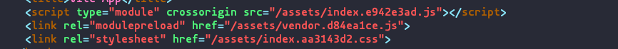
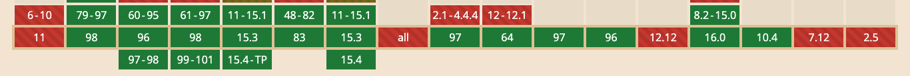
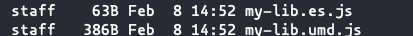

一切从这个plugin展开https://www.npmjs.com/package/@vitejs/plugin-legacy。

为什么会有这个plugin呢，因为vite的site模式，默认用的是es module。

一个最简单的vite项目打包出来是这样的：



Script 的type是module，/assets/index.e942e3ad.js 是这样的：

```javascript
import { d as defineComponent, r as ref, o as openBlock, c as createElementBlock, a as createBaseVNode, t as toDisplayString, F as Fragment, p as pushScopeId, b as popScopeId, e as createTextVNode, f as creat    eVNode, g as createApp } from "./vendor.d84ea1ce.js";
...
```

完全的es6 module语法。

这个目前的支持的浏览器情况是这样的：



详情见： https://caniuse.com/es6-module 和 https://caniuse.com/es6-module-dynamic-import

为了使用vite并且支持那些还不支持的浏览器，所以需要这个plugin。

使用了这个plugin后的vite配置是这样的：

```js
import { defineConfig } from 'vite'
import legacy from '@vitejs/plugin-legacy'
import vue from '@vitejs/plugin-vue'

// https://vitejs.dev/config/
export default defineConfig({
  build: {
    minify: false,
  },
  plugins: [
    legacy({
      targets: ['defaults', 'not IE 11']
    }),
    vue()]
})
```

build出来的index.html是这样：

```html
    <script type="module" crossorigin src="/assets/index.e942e3ad.js"></script>
    <link rel="modulepreload" href="/assets/vendor.d84ea1ce.js">
    <link rel="stylesheet" href="/assets/index.f792605a.css">
    <script type="module">!function(){try{new Function("m","return import(m)")}catch(o){console.warn("vite: loading legacy build because dynamic import is unsupported, syntax error above should be ignored");var e=document.getElementById("vite-legacy-polyfill"),n=document.createElement("script");n.src=e.src,n.onload=function(){System.import(document.getElementById('vite-legacy-entry').getAttribute('data-src'))},document.body.appendChild(n)}}();</script>
  </head>
  <body>
    <div id="app"></div>
    
    <script nomodule>!function(){var e=document,t=e.createElement("script");if(!("noModule"in t)&&"onbeforeload"in t){var n=!1;e.addEventListener("beforeload",(function(e){if(e.target===t)n=!0;else if(!e.target.hasAttribute("nomodule")||!n)return;e.preventDefault()}),!0),t.type="module",t.src=".",e.head.appendChild(t),t.remove()}}();</script>
    <script nomodule id="vite-legacy-polyfill" src="/assets/polyfills-legacy.55f99b09.js"></script>
    <script nomodule id="vite-legacy-entry" data-src="/assets/index-legacy.4d564f29.js">System.import(document.getElementById('vite-legacy-entry').getAttribute('data-src'))</script>

```


多了`<script nomodule`的标签，并且出现了systemjs。nomodule的意思就是不支持esmodule的浏览器会执行的脚本，支持的会自动忽略，具体看这https://stackoverflow.com/questions/45943494/what-s-the-purpose-of-the-html-nomodule-attribute-for-script-elements-if-the-d/45947601。

systemjs 是为浏览器设计的modlue系统，https://github.com/systemjs/systemjs。一个最简单的用法是这样的：

```js
//Say main.js depends on loading 'lodash', then we can define an import map:
<script src="system.js"></script>
<script type="systemjs-importmap">
{
  "imports": {
    "lodash": "https://unpkg.com/lodash@4.17.10/lodash.js"
  }
}
</script>
<!-- Alternatively:
<script type="systemjs-importmap" src="path/to/map.json" crossorigin="anonymous"></script>
-->
<script type="systemjs-module" src="/js/main.js"></script>
```


Vite 还有另外一种库模式。这种模式下不会使用`<script type="module"`, 配置是这样的：

```js
import path from 'path'
import { defineConfig } from 'vite'

// https://vitejs.dev/config/
export default defineConfig({
  build: {
    lib: {
      entry: path.resolve(__dirname, 'src/main.ts'),
      // formats: 'es',
      name: 'MyLib',
      fileName: (format) => `my-lib.${format}.js`
    },
    minify: false
  },
})
```

生产物是这样的：




其中`*.es.js` 也是es module的写法，对于不支持es module的浏览器直接用是不行的。可以用`umd`的包，或者使用的时候再打包编译一次。

跟浏览器兼容相关的还有个工具叫browserlist, https://github.com/browserslist/browserslist#best-practices, 可以在编译或者打包的时候，根据浏览器来转换，postcss和babel都用到了这个。

可以在命令行来查询，比如` npx browserslist "defaults and supports es6-module and supports es6-module-dynamic-import, not opera > 0, not samsung > 0, not and_qq > 0" ` 这个是vite支持的浏览器列表。

`@babel/preset-env`https://babeljs.io/docs/en/babel-preset-env 是我们常用到的，他就用了browserlist。

这里有两篇文章，非常清楚的介绍了@babel/preset-env：

https://shubo.io/babel-preset-env/ 这个扩展讲了`babel-preset-2015` 和 `@babel/plugin-transform-runtime` 

https://www.jiangruitao.com/babel/babel-preset-env/ 这个是babel教程中的一章，有非常详细的例子


另外还有两个工具：

https://polyfill.io/v3/supported-browsers/ 生成pollyfill，可以根据浏览器或者es feature

https://live.browserstack.com/dashboard#os=Windows&os_version=XP&browser=IE&browser_version=8.0&zoom_to_fit=true&full_screen=true&resolution=responsive-mode&url=https%3A%2F%2Fconsent.google.com%2Fml%3Fcontinue%3Dhttps%3A%2F%2Fwww.google.com%2F%3Fgws_rd%3Dssl%26gl%3DNL%26m%3D0%26pc%3Dshp%26hl%3Den%26src%3D1&speed=1

一个在线服务，可以在线测试各种浏览器下你的网站


